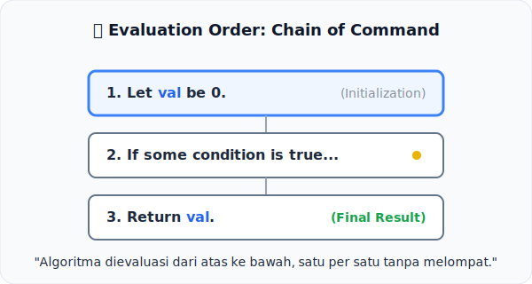

# CH-01: Evaluation Order

*Pemetaan ECMA-262: Clause 5.2.1*

Segala sesuatu dalam spesifikasi memiliki urutan. Tanpa aturan urutan, sebuah bahasa pemrograman akan menjadi kacau.

## Mental Model: "Rantai Eksekusi"
Bayangkan Anda sedang membaca sebuah **Resep Masakan**. Anda tidak boleh memasukkan telur sebelum memecahkan cangkangnya. Algoritma dalam spesifikasi bekerja dengan cara yang sama: mereka adalah rangkaian langkah-langkah yang harus diikuti dari atas ke bawah.

---

## 1. Eksekusi Sekuensial
Aturan dasar Clause 5.2.1 menyatakan bahwa algoritma secara umum dievaluasi secara berurutan:
- **Top-to-Bottom**: Langkah 1 harus selesai sebelum Langkah 2 dimulai.
- **Determinism**: Dengan input yang sama, urutan langkah ini menjamin hasil yang sama di semua browser.

## 2. Percabangan & Aliran
Meskipun urutannya dari atas ke bawah, spec sering kali memiliki instruksi percabangan (*If/Else*) atau pengulangan (*Repeat*). Namun, setelah cabang tersebut selesai, aliran akan kembali ke langkah berikutnya dalam daftar utama.

---

## Arsitek Mindset: Membaca Tanpa Melompat
Saat membaca spesifikasi, jangan pernah mencoba menebak hasil akhir sebelum Anda menelusuri setiap baris teks. Seringkali, rahasia di balik sebuah bug aneh JavaScript terletak pada satu langkah kecil di tengah-tengah algoritma yang sering kita lewati.

---

## Referensi Terkait
- [ECMA-262 Clause 5.2.1 - Evaluation Order](https://tc39.es/ecma262/#sec-algorithm-conventions-evaluation-order)

---
> [!TIP]  
> Lihat bagaimana urutan eksekusi disimulasikan dalam kode di [examples/sequential_eval_sim.js](./examples/sequential_eval_sim.js).
ki efek samping (*Side Effects*), urutan eksekusi menjadi sangat krusial. 
Contoh: `a() + b()`. Spesifikasi menjamin `a()` akan selesai dieksekusi sebelum `b()` dimulai.

---
> [!IMPORTANT]
> **Architect Insight:** Jangan pernah menulis kode yang sangat bergantung pada urutan evaluasi yang rumit. Meskipun spesifikasi menjamin urutannya, kode tersebut akan sangat sulit dibaca dan dipelihara oleh manusia.
