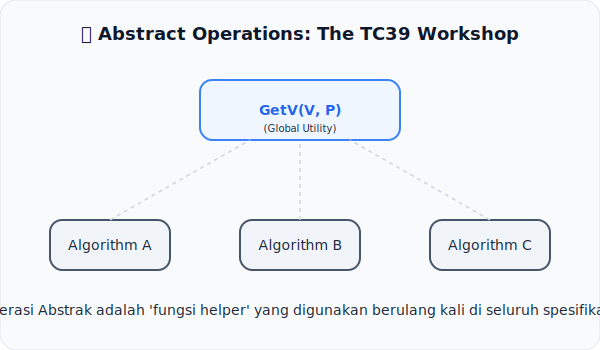

# CH-02: Abstract Operations

*Pemetaan ECMA-262: Clause 5.2.2*

Spesifikasi tidak ingin menulis ulang logika yang sama seribu kali. Solusinya? **Abstract Operations**.

## Mental Model: "Workshop TC39"
Bayangkan sebuah bengkel besar (**Workshop**). Di sana terdapat berbagai alat perkakas yang sudah jadi (misal: Obeng, Palu, Kunci Inggris). Ketika arsitek ingin menjelaskan cara merakit mesin (Fitur JS), mereka tidak lagi menjelaskan cara membuat obeng, tapi cukup berkata: "Gunakan Obeng untuk memasang sekrup X."

Dalam spesifikasi, **Abstract Operations** adalah alat-alat perkakas tersebut. Mereka adalah rutin yang didefinisikan secara terpisah agar bisa dipanggil oleh algoritma apa pun.

---

## 1. Apa itu Abstract Operation?
Abstract Operation (AO) adalah prosedur internal spesifikasi yang:
- **Nama Unik**: Menggunakan format `NamaOperasi(argumen1, argumen2, ...)`.
- **Reusable**: Satu AO (seperti `ToBoolean` atau `Get`) dipanggil oleh puluhan fitur JavaScript berbeda.
- **Bukan API**: AO tidak bisa dipanggil langsung oleh programmer JavaScript. Mereka hanya ada di dalam teks spesifikasi.

## 2. Mengapa Penting bagi Arsitek?
Memahami AO adalah kunci untuk memahami konsistensi. Jika Anda tahu persis bagaimana `ToBoolean` bekerja, Anda tahu persis bagaimana perilaku *Truthiness* di seluruh bahasa JavaScript—mulai dari `if`, `while`, hingga operator logika.

---

## Arsitek Mindset: Abstraksi adalah Kekuatan
Jangan menganggap AO sebagai "fungsi hitam" yang misterius. Lihatlah mereka sebagai unit logika terkecil yang menjaga integritas bahasa. Mempelajari AO berarti mempelajari peraturan dasar permainan JavaScript.

---

## Referensi Terkait
- [ECMA-262 Clause 5.2.2 - Abstract Operations](https://tc39.es/ecma262/#sec-abstract-operations)

---
> [!TIP]  
> Lihat simulasi kerja sebuah Abstract Operation secara internal di [examples/abstract_op_sim.js](./examples/abstract_op_sim.js).
