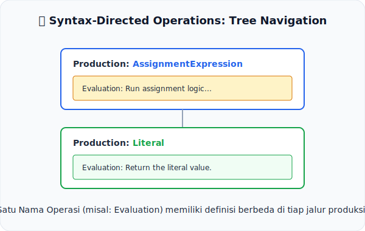

# CH-03: Syntax-Directed Operations

*Pemetaan ECMA-262: Clause 5.2.3*

Jika **Abstract Operations** didefinisikan secara global, maka **Syntax-Directed Operations** didefinisikan secara spesifik menempel pada unit grammar.

## Mental Model: "Jalur Navigasi Pohon"
Bayangkan Anda sedang berada di sebuah **Taman Labirin** yang berbentuk pohon. Di setiap persimpangan (Unit Grammar), terdapat instruksi yang berbeda untuk tindakan yang sama, misalnya "Berjalan".
- Jika persimpangan berbentuk Lingkaran, "Berjalan" berarti melompat.
- Jika persimpangan berbentuk Kotak, "Berjalan" berarti lari.

Dalam spesifikasi, **Syntax-Directed Operations (SDO)** bekerja seperti itu. Operasi seperti `Evaluation` didefinisikan berulang kali untuk setiap *Production* yang berbeda (seperti `IfStatement`, `BinaryExpression`, dkk).

---

## 1. Apa itu Syntax-Directed Operation?
SDO adalah operasi abstrak yang definisinya bergantung pada struktur pohon parser (*Parse Tree*):
- **Polimorfisme Spec**: Satu nama operasi bisa memiliki ratusan definisi berbeda tergantung di mana ia dipanggil.
- **Recursive Nature**: SDO sering kali memanggil dirinya sendiri pada anak-anak dari unit grammar tersebut (misalnya, mengevaluasi sub-ekspresi).

## 2. Contoh Utama: Evaluation
Hampir seluruh proses eksekusi kode JavaScript di spesifikasi dilakukan melalui SDO bernama `Evaluation`. Cara JavaScript mengevaluasi angka `5` berbeda dengan cara ia mengevaluasi ekspresi `5 + 5`, meskipun keduanya menggunakan nama operasi yang sama: `Evaluation`.

---

## Arsitek Mindset: Memahami Konteks adalah Kunci
Anda tidak bisa memahami sebuah SDO hanya dengan membaca satu definisinya. Anda harus tahu di unit grammar mana Anda berada. Mempelajari SDO berarti belajar mengikuti alur logika spec dari akar pohon hingga ke daunnya (*Terminal Symbols*).

---

## Referensi Terkait
- [ECMA-262 Clause 5.2.3 - Syntax-Directed Operations](https://tc39.es/ecma262/#sec-syntax-directed-operations)

---
> [!TIP]  
> Lihat bagaimana operasi `Evaluation` bekerja secara dinamis berdasarkan tipe node dalam [examples/sdo_eval_sim.js](./examples/sdo_eval_sim.js).
