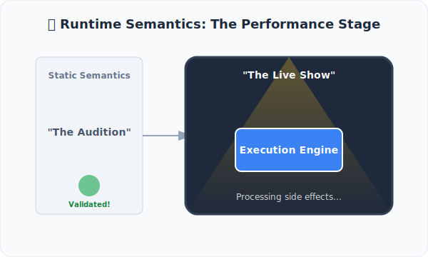

# CH-04: Runtime Semantics Overview

*Pemetaan ECMA-262: Clause 5.2.4*

Setelah grammar dipahami dan notasi dibedah, tiba saatnya kita melihat bagaimana algoritma spesifikasi benar-benar "berlari" saat aplikasi dijalankan.

## Mental Model: "Pentas Pertunjukan"
Bayangkan sebuah **Produksi Teater**. 
- **Static Semantics** adalah sesi audisi dan gladi resik. Jika kostum salah atau naskah tidak hafal, aktor tidak boleh naik panggung.
- **Runtime Semantics** adalah **Malam Pertunjukan** yang sesungguhnya. Inilah saat emosi keluar, lampu sorot menyala, dan penonton (User) melihat hasilnya.

Dalam spesifikasi, **Runtime Semantics** adalah algoritma yang menangani perilaku dinamis kode—seperti menghitung nilai, mengubah memori, atau melempar error saat aplikasi sedang berjalan.

---

## 1. Apa itu Runtime Semantics?
Runtime Semantics adalah aliran algoritma yang menentukan apa yang terjadi setelah tahap parsing selesai:
- **Side Effects**: Semua perubahan pada *Global Object*, *Execution Context*, dkk terjadi di sini.
- **Completion**: Hasil akhir dari sebuah blok kode (apakah mengembalikan nilai atau melempar error) didefinisikan secara ketat dalam runtime.

## 2. Hubungan dengan SDO
Hampir semua Runtime Semantics diimplementasikan sebagai **Syntax-Directed Operations** (seperti yang kita pelajari di Bab sebelumnya). Operasi paling ikonik adalah `Evaluation`, yang merupakan pintu masuk utama bagi runtime untuk menjalankan unit grammar apa pun.

---

## Arsitek Mindset: Pahami Panggung, Kuasai Pertunjukan
Sebagai seorang arsitek senior, Anda harus tahu kapan sebuah aturan dicek (Static) dan kapan sebuah efek samping terjadi (Runtime). Memahami Clause 5.2.4 akan membantu Anda memprediksi perilaku kode JavaScript Anda tanpa perlu menebak-nebak.

---

## Referensi Terkait
- [ECMA-262 Clause 5.2.4 - Runtime Semantics](https://tc39.es/ecma262/#sec-runtime-semantics)

---
> [!TIP]  
> Bedakan antara validasi statis dan eksekusi dinamis melalui simulasi di [examples/static_vs_runtime_sim.js](./examples/static_vs_runtime_sim.js).
