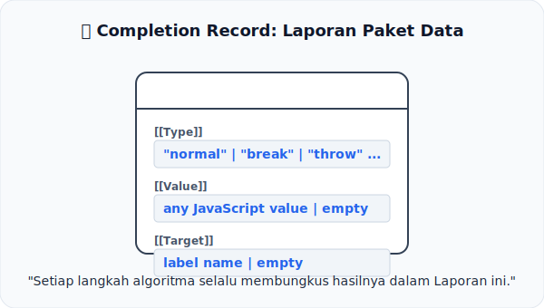

# CH-05: Completion Records

*Pemetaan ECMA-262: Clause 6.2.4 (The Completion Record Specification Type)*

Dalam dunia nyata, setiap pekerjaan diakhiri dengan laporan. Di dalam spesifikasi, setiap langkah algoritma diakhiri dengan **Completion Record**.

## Mental Model: "Laporan Paket Data"
Bayangkan sebuah **Kurir** yang mengantar paket. Kurir tersebut tidak hanya memberikan paketnya kepada Anda, tapi ia membawa **Lembar Laporan** yang berisi:
1.  **Status**: Apakah paket terkirim (*normal*), ditolak (*throw*), atau dialihkan (*break*).
2.  **Isi**: Barang yang ada di dalam paket tersebut (*value*).
3.  **Catatan**: Intruksi khusus jika paket harus dibawa ke lokasi lain (*target*).

Dalam spesifikasi, **Completion Record** adalah lembar laporan tersebut. Ia membungkus setiap hasil eksekusi agar langkah berikutnya tahu apakah harus lanjut atau berhenti.

---

## 1. Anatomi Completion Record
Setiap Completion Record memiliki tiga field internal:
- **[[Type]]**: Bisa berupa `normal`, `break`, `continue`, `return`, atau `throw`.
- **[[Value]]**: Nilai JavaScript yang dihasilkan (jika ada).
- **[[Target]]**: Label navigasi (digunakan oleh statement `break` atau `continue`).

## 2. Normal vs Abrupt Completion
- **Normal Completion**: Terjadi jika [[Type]] adalah `normal`. Algoritma lanjut ke langkah berikutnya.
- **Abrupt Completion**: Terjadi jika [[Type]] selain `normal`. Ini adalah sinyal bahwa aliran eksekusi harus "melompat" (seperti saat ada `return` atau `throw`).

---

## Arsitek Mindset: Semua adalah Record
Pahami bahwa di level spesifikasi, tidak ada "nilai telanjang". Semuanya dibungkus dalam record. Memahami Completion Record adalah kunci untuk mengerti bagaimana `try-catch` bekerja dan bagaimana `return` bisa menghentikan fungsi di tengah jalan.

---

## Referensi Terkait
- [ECMA-262 Clause 6.2.4 - The Completion Record Specification Type](https://tc39.es/ecma262/#sec-completion-record-specification-type)

---
> [!TIP]  
> Pelajari bagaimana record ini bekerja secara internal melalui simulasi kode di [examples/completion_record_sim.js](./examples/completion_record_sim.js).
