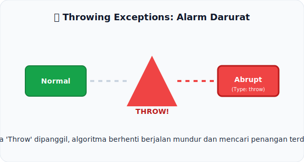

# CH-06: Throwing Exceptions

*Pemetaan ECMA-262: Clause 5.2.4.2*

Apa yang terjadi ketika spesifikasi berkata "Throw a TypeError"? Di balik kalimat sederhana itu, terdapat mekanisme yang sangat kuat.

## Mental Model: "Alarm Darurat"
Bayangkan sebuah **Pabrik Otomatis**. Selagi mesin berjalan normal, lampu berwarna hijau (**Normal Completion**). Namun, jika ada komponen yang macet, sensor akan memicu **Alarm Darurat** berwarna merah (**Throw**). 
- Begitu alarm menyala, seluruh proses di ban berjalan tersebut **berhenti seketika**. 
- Alarm tersebut akan terus berbunyi ke seluruh departemen (Call Stack) sampai ada manajer yang menekan tombol "Reset" (**Catch**).

Dalam spesifikasi, instruksi `throw` adalah sensor yang memicu alarm darurat tersebut, mengubah status eksekusi menjadi *Abrupt Completion*.

---

## 1. Mekanisme "Abruptness"
Ketika sebuah langkah algoritma menghasilkan Completion Record bertipe `throw`:
- **Immediate Stop**: Langkah-langkah di bawahnya dalam algoritma yang sama tidak akan pernah dieksekusi.
- **Propagation**: Record tersebut akan dikembalikan ke "pemanggil" algoritmanya. Si pemanggil juga akan langsung berhenti dan meneruskannya ke atas, kecuali si pemanggil memiliki instruksi penanganan (seperti `try-catch`).

## 2. Definisi vs Objek
Penting untuk dibedakan:
- **Throw**: Adalah tindakan mengubah [[Type]] menjadi `throw`.
- **Exception Value**: Adalah isi dari [[Value]], biasanya berupa objek seperti `TypeError`, `ReferenceError`, dkk.

---

## Arsitek Mindset: Defensive Logic
Memahami cara spec melempar error membantu Anda menulis kode JavaScript yang lebih tangguh. Anda jadi mengerti kenapa `try-catch` bisa sangat mahal jika digunakan sembarangan—karena ia menghentikan seluruh "ban berjalan" algoritma spesifikasi.

---

## Referensi Terkait
- [ECMA-262 Clause 5.2.4.2 - Throwing Exceptions](https://tc39.es/ecma262/#sec-algorithm-conventions-throwing-exceptions)

---
> [!TIP]  
> Lihat bagaimana "Alarm" ini menjalar melalui stack pemanggilan dalam simulasi di [examples/exception_demo.js](./examples/exception_demo.js).
