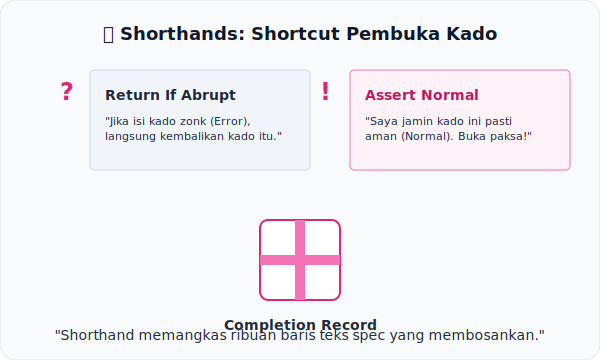

# CH-07: Shorthands (?, !)

*Pemetaan ECMA-262: Clause 5.2.4.3*

Jika editor spesifikasi harus menulis `If result is an abrupt completion, return result` setiap kali mereka memanggil fungsi, spesifikasi akan menjadi sejuta halaman lebih tebal. Solusinya adalah **Shorthand**.

## Mental Model: "Shortcut Pembuka Kado"
Bayangkan setiap hasil operasi adalah sebuah **Kado** (Completion Record). Ada dua cara cepat untuk membukanya:

1.  **Shorthand `?` (The Cautious Opener)**: Sering disebut *ReturnIfAbrupt*. Anda menempelkan telinga ke kado tersebut. Jika terdengar bunyi dentuman (*Error/Abrupt*), Anda tidak berani membukanya dan langsung mengembalikan kado itu ke pengirimnya. Jika diam (*Normal*), Anda baru berani membongkar isinya.
2.  **Shorthand `!` (The Brave Opener)**: Anda sangat yakin kado itu berisi hadiah aman. Jadi, Anda langsung menyobek bungkusnya tanpa mengecek. Jika ternyata isinya zonk (di spec ini dianggap mustahil lewat pembuktian logika), itu berarti ada kesalahan fatal di level desain bahasa.

---

## 1. Tanda Tanya (`?`)
Digunakan untuk operasi yang **bisa gagal**.
- Cara bacanya: `result = ? SomeOperation()`
- Artinya: "Panggil operasi tersebut. Jika gagal, stop dan kembalikan error. Jika sukses, ambil nilainya saja."

## 2. Tanda Seru (`!`)
Digunakan untuk operasi yang **dijamin sukses** oleh logika spesifikasi.
- Cara bacanya: `result = ! SomeOperation()`
- Artinya: "Buka isinya langsung. Saya jamin tidak akan melempar error."

---

## Arsitek Mindset: Efisiensi Visual
Gunakan pemahaman shorthand ini untuk membedah algoritma spec dengan mata yang lebih tajam. Saat Anda melihat `?`, Anda tahu itu adalah titik rawan kegagalan. Saat melihat `!`, Anda tahu itu adalah area yang stabil secara matematis.

---

## Referensi Terkait
- [ECMA-262 Clause 5.2.4.3 - Shorthands for Unwrapping Completion Records](https://tc39.es/ecma262/#sec-shorthands-for-unwrapping-completion-records)

---
> [!TIP]  
> Rasakan bagaimana shorthand ini menghemat ribuan baris logic dalam simulasi di [examples/shorthand_usage.js](./examples/shorthand_usage.js).
