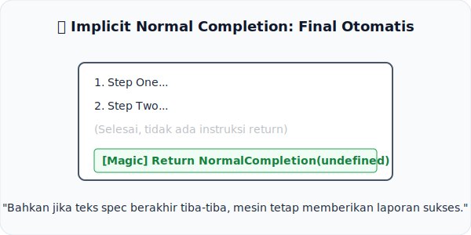

# CH-08: Implicit Normal Completion

*Pemetaan ECMA-262: Clause 5.2.4.4*

Kadang-kadang, apa yang tidak tertulis sama pentingnya dengan apa yang tertulis. Itulah filosofi di balik **Implicit Normal Completion**.

## Mental Model: "Final Otomatis"
Bayangkan Anda sedang menonton sebuah **Pertunjukan Sulap**. Setelah sang pesulap selesai melakukan triknya, ia hanya membungkuk dan berjalan keluar panggung tanpa mengatakan apa-apa.
- Secara otomatis, semua orang tahu bahwa pertunjukan telah **selesai dengan sukses** (Normal). 
- Anda tidak butuh sang pesulap berteriak "Saya sudah selesai dan tidak ada error!" setiap kali.

Dalam spesifikasi, jika serangkaian langkah algoritma berakhir tanpa ada instruksi `return`, spesifikasi secara otomatis mengasumsikan bahwa algoritma tersebut berakhir dengan sukses (*Normal Completion*) dan mengembalikan nilai kosong (*undefined*).

---

## 1. Aturan Keheningan
Banyak prosedur dalam spesifikasi (seperti prosedur inisialisasi internal) tidak mereturn nilai apa pun secara eksplisit. Tanpa aturan Clause 5.2.4.4 ini, algoritma tersebut akan dianggap "menggantung".
- Teks Spec berakhir -> Mesin secara otomatis menyisipkan: `Return NormalCompletion(undefined)`.

## 2. Pengecualian
Aturan ini hanya berlaku untuk **Runtime Semantics**. Jika sebuah algoritma memang dirancang untuk mereturn nilai spesifik (seperti dalam operasi matematika atau pencarian data), maka editor spec biasanya menuliskannya secara eksplisit untuk menghindari kebingungan.

---

## Arsitek Mindset: Kesimpulan yang Tenang
Jangan bingung ketika melihat algoritma spec yang tampak mendadak terhenti. Sebagai arsitek, Anda harus bisa "mendengar" suara implisit dari spesifikasi. Keheningan di akhir algoritma adalah tanda bahwa semuanya berjalan lancar sesuai rencana.

---

## Referensi Terkait
- [ECMA-262 Clause 5.2.4.4 - Implicit Normal Completion](https://tc39.es/ecma262/#sec-implicit-normal-completion)

---
> [!TIP]  
> Lihat bagaimana keheningan teks spec diterjemahkan menjadi hasil normal dalam simulasi di [examples/implicit_return_sim.js](./examples/implicit_return_sim.js).
