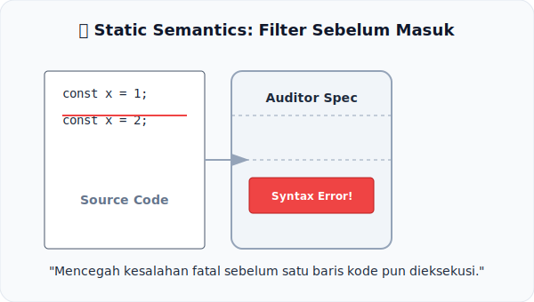

# CH-09: Static Semantics

*Pemetaan ECMA-262: Clause 5.2.5*

Sebelum aktor naik panggung, mereka harus melewati audisi. Dalam JavaScript, sebelum kode dijalankan, ia harus melewati **Static Semantics**.

## Mental Model: "Filter Sebelum Masuk"
Bayangkan sebuah **Gerbang Keamanan** di sebuah konser. 
- Petugas keamanan tidak menunggu Anda membuat keributan di dalam gedung. 
- Mereka memeriksa Anda **di gerbang**. Jika Anda membawa barang terlarang (seperti deklarasi variabel duplikat atau label yang tidak valid), Anda dilarang masuk sejak awal.

Dalam spesifikasi, **Static Semantics** adalah petugas keamanan tersebut. Ia mendefinisikan aturan "Early Errors" yang harus dipenuhi agar kode dianggap valid untuk dieksekusi.

---

## 1. Early Errors
Karakteristik utama dari Static Semantics adalah menghasilkan **Syntax Error** sebelum langkah pertama algoritma runtime dijalankan.
- **Scope Checking**: Memastikan tidak ada dua variabel `let` dengan nama yang sama dalam satu scope.
- **Label Validation**: Memastikan target `break` atau `continue` benar-benar ada.

## 2. Abstraksi Audit
Spec mendefinisikan aturan statis bukan sebagai aliran waktu, melainkan sebagai sekumpulan "predikat" atau kondisi yang harus bernilai benar. Jika ada satu saja aturan yang dilanggar, seluruh skrip/module ditolak oleh engine.

---

## Arsitek Mindset: Cegah Error Sejak Dini
Memahami Static Semantics membantu Anda mengerti mengapa beberapa error di JavaScript muncul seketika saat file di-load, sementara yang lain baru muncul saat fungsi dipanggil. Sebagai arsitek, mengandalkan pengecekan statis (dan tools seperti ESLint/TypeScript) adalah cara terbaik menjaga integritas sistem.

---

## Referensi Terkait
- [ECMA-262 Clause 5.2.5 - Static Semantics](https://tc39.es/ecma262/#sec-static-semantics)

---
> [!TIP]  
> Lihat bagaimana spec melakukan audit terhadap variabel duplikat dalam simulasi di [examples/static_audit_sim.js](./examples/static_audit_sim.js).
