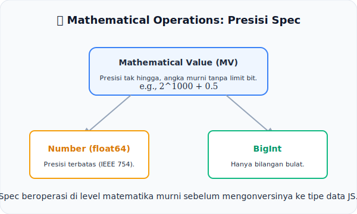

# CH-10: Mathematical Operations

*Pemetaan ECMA-262: Clause 5.2.6*

Komputer sering kali berbohong soal angka (Halo, `0.1 + 0.2`). Agar tidak terjadi kebohongan, spesifikasi menggunakan standar matematika sendiri.

## Mental Model: "Presisi Matematika"
Bayangkan sebuah **Laboratorium Fisika Dasar**. 
- Di papan tulis, fisikawan menulis rumus dengan presisi tak hingga (misal: $\pi$ dengan triliunan angka). Inilah **Mathematical Value (MV)** di spesifikasi.
- Namun, saat insinyur membangun alat ukur (Engine JS), mereka terpaksa menggunakan sensor dengan batas bit tertentu (64-bit float).

Spesifikasi memisahkan dengan tegas antara **Matematika Murni** yang ideal (MV) dan **Tipe Data Implementasi** (Number & BigInt).

---

## 1. Mathematical Values (MV)
Dalam teks algoritma, ketika spesifikasi menyebut angka seperti "10", itu adalah angka matematika murni, bukan Number JavaScript.
- MV tidak memiliki batas besaran.
- MV tidak memiliki isu presisi desimal.

## 2. Operasi Number vs BigInt
Spesifikasi memiliki aturan ketat untuk operasi matematika:
- **Number**: Mengikuti standar IEEE 754 (Double Precision).
- **BigInt**: Mengikuti aturan bilangan bulat arbitrer.
- **Konversi**: Spec mendefinisikan secara eksplisit kapan sebuah MV harus dikonversi menjadi Number atau BigInt menggunakan operasi seperti `Number::add` atau `BigInt::multiply`.

---

## Arsitek Mindset: Pahami Batas Realita
Jangan kaget dengan anomali matematika di JavaScript. Semuanya sudah diprediksi dan diatur dalam Clause 5.2.6. Memahami perbedaan antara MV dan Tipe Data Implementasi akan membantu Anda menghindari bug presisi yang fatal dalam aplikasi skala besar.

---

## Referensi Terkait
- [ECMA-262 Clause 5.2.6 - Mathematical Operations](https://tc39.es/ecma262/#sec-mathematical-operations)

---
> [!TIP]  
> Rasakan perbedaan antara matematika ideal spesifikasi dan implementasi Number yang terbatas dalam simulasi di [examples/spec_math_sim.js](./examples/spec_math_sim.js).
