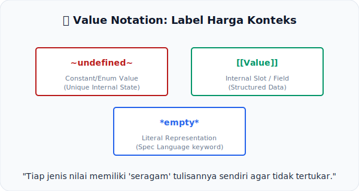

# CH-11: Value Notation

*Pemetaan ECMA-262: Clause 5.2.7*

Bagaimana cara membedakan antara "Nilai yang kosong" dan "Variabel bernama kosong"? Spesifikasi menjawabnya lewat **Value Notation**.

## Mental Model: "Label Harga & Seragam"
Bayangkan Anda berada di sebuah **Supermarket Global**.
- Semua **Produk Makanan** menggunakan label berwarna Hijau.
- Semua **Produk Kebersihan** menggunakan label berwarna Biru.
- Anda tidak perlu membaca isinya satu-persatu, cukup lihat warnanya dan Anda tahu kategori produk tersebut.

Dalam spesifikasi, **Value Notation** adalah sistem pelabelan atau "seragam" tulisan tersebut. Tiap jenis nilai internal memiliki cara tulis yang unik agar tidak tertukar satu sama lain.

---

## 1. Jenis-Jenis Notasi
Spesifikasi menggunakan simbol khusus untuk memberikan konteks instan:
- **`~undefined~` (Tilde)**: Digunakan untuk nilai konstanta internal atau status enumerasi.
- **`[[Value]]` (Double Bracket)**: Digunakan untuk merujuk pada *Internal Slot* atau *Field* di dalam sebuah Record/Object.
- **`*true*` (Asterisk Bold)**: Digunakan untuk nilai literal bahasa (seperti Boolean atau string tertentu).

## 2. Mengapa Sangat Ketat?
Tanpa notasi ini, pembaca spesifikasi akan bingung. Misalnya, kata "empty" bisa berarti string `"empty"`, variabel bernama `empty`, atau status internal yang benar-benar kosong. Dengan notasi `~empty~`, semua orang sepakat bahwa itu adalah status internal spesifikasi.

---

## Arsitek Mindset: Bahasa yang Presisi
Seorang arsitek senior tidak hanya membaca teks, tapi membaca struktur. Memahami notasi nilai dalam Clause 5.2.7 adalah langkah terakhir untuk benar-benar "fasih" berbahasa spesifikasi. Anda tidak lagi menebak makna sebuah kata, karena bentuk tulisannya sudah memberitahu Anda kategorinya.

---

## Referensi Terkait
- [ECMA-262 Clause 5.2.7 - Value Notation](https://tc39.es/ecma262/#sec-value-notation)

---
> [!TIP]  
> Lihat bagaimana perbedaan notasi ini dipetakan dalam pemahaman kode melalui simulasi di [examples/notation_mapper_sim.js](./examples/notation_mapper_sim.js).
