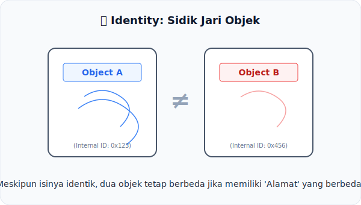

# CH-12: Identity

*Pemetaan ECMA-262: Clause 5.2.8*

Mengapa `{}` tidak sama dengan `{}`? Pertanyaan filosofis JavaScript ini dijawab secara teknis dalam **Identity**.

## Mental Model: "Sidik Jari Objek"
Bayangkan dua orang yang **Kembar Identik**.
- Mereka memiliki wajah yang sama, tinggi yang sama, dan suara yang sama.
- Namun, mereka tetap dua individu yang berbeda. Mereka memiliki **Sidik Jari** yang berbeda dan berdiri di koordinat ruang yang berbeda.

Dalam spesifikasi, ketika sebuah objek dibuat, ia mendapatkan sebuah "Identitas Unik" yang tidak bergantung pada properti di dalamnya. Identitas ini seperti sidik jari yang melekat seumur hidup objek tersebut.

---

## 1. Konsep Identitas Spesifikasi
Di dalam teks algoritma, "Identity" merujuk pada keunikan sebuah entitas (terutama Objek):
- **Object Creation**: Setiap kali instruksi "OrdinaryObjectCreate" dijalankan, identitas baru lahir.
- **Comparison**: Operasi perbandingan seperti `SameValue` mengecek apakah dua referensi menunjuk ke identitas yang sama, bukan apakah isinya sama.

## 2. Nilai Primitif vs Objek
Berbeda dengan objek, nilai primitif (seperti angka atau string) tidak memiliki identitas yang "hidup". Angka `5` selalu sama dengan angka `5` di mana pun ia berada. Namun, objek `{}` di baris 1 adalah entitas yang berbeda total dengan objek `{}` di baris 2.

---

## Arsitek Mindset: Referensi adalah Segalanya
Sebagai arsitek, memahami identitas adalah kunci untuk mengelola state dan memori. Kesalahan dalam memahami identitas sering kali berujung pada bug mutasi objek yang tidak disengaja. Ingatlah: menyalin objek hanya menyalin "nama panggilannya", bukan menciptakan sidik jari baru.

---

## Referensi Terkait
- [ECMA-262 Clause 5.2.8 - Identity](https://tc39.es/ecma262/#sec-algorithm-conventions-identity)

---
> [!TIP]  
> Lihat bagaimana mesin membedakan dua objek yang tampak sama lewat simulasi identitas di [examples/identity_sim.js](./examples/identity_sim.js).
