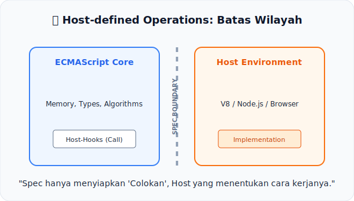

# CH-13: Host-defined Operations

*Pemetaan ECMA-262: Supplemental Integration*

JavaScript tidak hidup sendirian. Ia butuh rumah (Host) seperti Browser atau Node.js untuk bisa berinteraksi dengan dunia luar. Di sinilah **Host-defined Operations** berperan.

## Mental Model: "Batas Wilayah Browser"
Bayangkan sebuah **Negara (ECMAScript)** yang sangat tertib. Ia memiliki hukum sendiri (Types, Logic, Algorithms). Namun, negara ini tidak punya akses ke laut. Untuk bisa berdagang ke luar negeri (Akses File, Jaringan, DOM), ia harus bekerja sama dengan **Otoritas Pelabuhan (Host Environment)**.
- Negara menyiapkan **Dokumen Kontrak (Hook)**.
- Otoritas Pelabuhan yang menentukan **Cara Kerjanya** sesuai fasilitas yang ada di sana.

Dalam spesifikasi, banyak operasi yang diakhiri dengan kalimat "...is host-defined". Ini berarti spesifikasi menyerahkan detail implementasinya kepada engine (V8, JavaScriptCore) berdasarkan lingkungannya.

---

## 1. Apa itu Host-defined Operation?
Host-defined Operation adalah "Colokan" atau *Hook* yang disediakan oleh spesifikasi ECMAScript agar lingkungan luar bisa menyisipkan logikanya sendiri:
- **HostEnqueuePromiseJob**: Cara antrean Promise dijalankan (Microtasks).
- **HostEnsureCanCompileStrings**: Mengecek apakah `eval()` atau `new Function()` diizinkan (Security Policy/CSP).
- **Import Maps**: Cara browser menemukan lokasi file saat Anda melakukan `import`.

## 2. Mengapa Ini Penting?
Tanpa sistem ini, ECMAScript akan menjadi sangat kaku dan tidak bisa berjalan di platform yang berbeda. Dengan memisahkan logika inti bahasa dari logika infrastruktur host, JavaScript bisa berjalan mulus di jam tangan pintar (IoT), server raksasa, hingga browser seluler.

---

## Arsitek Mindset: Sadari Batas Kemampuan
Sebagai arsitek, sangat penting untuk tahu mana aturan yang datang dari "Bahasa" (ECMAScript) dan mana yang datang dari "Rumah" (Web API/Node API). Jika sebuah fungsi berperilaku berbeda antara Chrome dan Safari, kemungkinan besar itu adalah area *Host-defined*.

---

## Referensi Terkait
- [ECMA-262 - Host-defined Operations Overview](https://tc39.es/ecma262/#sec-host-defined-operations)

---
> [!TIP]  
> Lihat bagaimana spesifikasi berinteraksi dengan lingkungan luar melalui simulasi hook di [examples/host_ops_sim.js](./examples/host_ops_sim.js).
