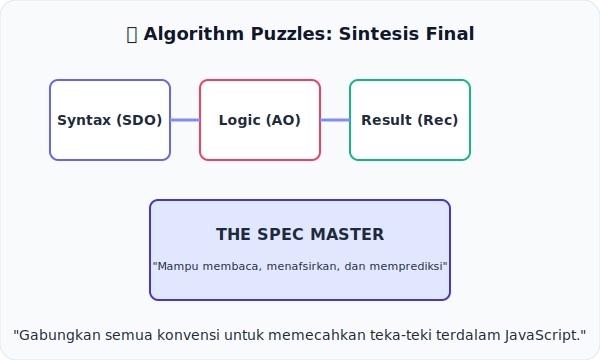

# CH-14: Algorithm Puzzles & Edge Cases

*Sintesis Final Perjalanan Anda*

Selamat! Anda telah sampai di ujung perjalanan BK-03. Sekarang saatnya menguji semua senjata yang telah Anda susun di bab-bab sebelumnya.

## Mental Model: "Sintesis Final"
Seorang master spesifikasi bukan orang yang menghafal seluruh teks, melainkan orang yang bisa menggabungkan berbagai potongan puzzle (SDO, AO, Shorthands, Records) menjadi sebuah gambaran utuh tentang cara kerja sebuah fitur.

---

## 1. Menghubungkan Titik-Titik
Di bab ini, kita tidak menambah notasi baru. Kita akan belajar cara membaca algoritma kompleks yang menggabungkan segalanya:
- Bagaimana sebuah **SDO Evaluation** memanggil **Abstract Operation** internal...
- Sambil menangani **Completion Record** menggunakan **Shorthand `?`**...
- Dan diakhiri dengan **Implicit Normal Completion**.

## 2. Bedah Kasus Efek Samping
Kita juga akan melihat bagaimana sebuah algoritma spesifikasi menangani "Edge Cases" atau kasus batas. Seringkali, perilaku JavaScript yang kita anggap "aneh" sebetulnya adalah hasil logis dari pertemuan beberapa aturan spesifikasi yang berbeda.

---

## Arsitek Mindset: Kefasihan Tanpa Batas
Kefasihan Anda dalam membaca BK-03 akan menjadi tiket masuk untuk memahami buku-buku berikutnya yang jauh lebih kompleks (seperti Executable Code & Execution Contexts). Jangan berhenti di sini. Gunakan pemahaman naratif dan simulasi yang telah Anda pelajari untuk menaklukkan setiap baris spesifikasi yang Anda temui.

---

## Tantangan Akhir
Jalankan file [examples/puzzle_synthesis.js](./examples/puzzle_synthesis.js) dan cobalah untuk memprediksi hasilnya sebelum Anda melihat output konsol. Jika Anda bisa menjelaskan alasannya berdasarkan bab-bab di buku ini, berarti Anda telah lulus sebagai **Master Konvensi Algoritma**.

---
> [!IMPORTANT]  
> Anda sekarang telah menguasai "Alfabet" algoritma TC39. Sampai jumpa di buku berikutnya!
