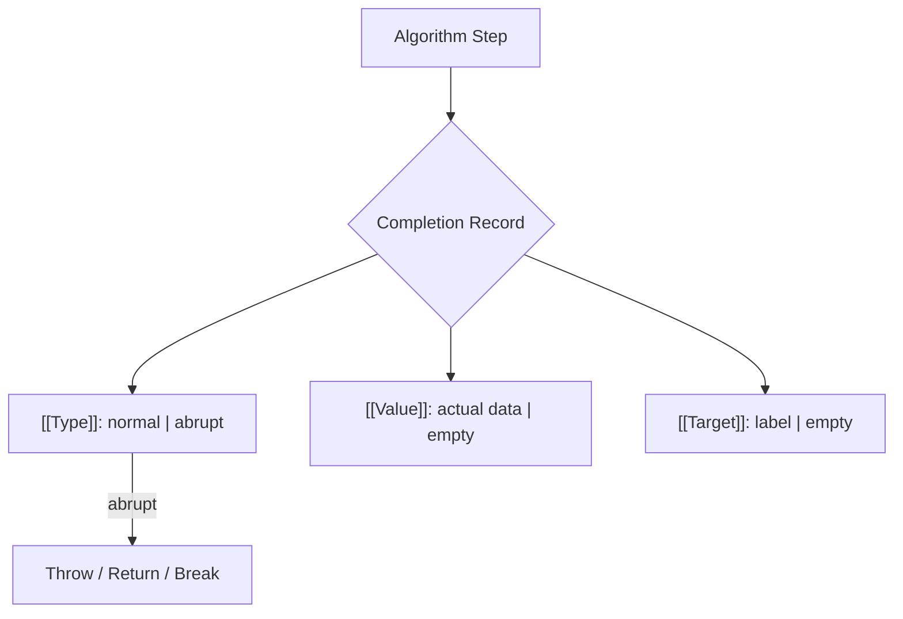

# BK-03: Spec Algorithm Conventions (Clause 5.2)

> [!IMPORTANT]
> **Sinopsis:** Menguasai "Bahasa Mesin" yang digunakan TC39. Jika BK-02 adalah tentang membaca blueprint gedung, maka BK-03 adalah tentang memahami bagaimana mesin-mesin di dalam gedung tersebut bekerja, berkomunikasi, dan menangani kegagalan.

## 🏗️ Completion Record Anatomy

## 1. Mengapa Anda Harus Bisa Membaca Ini?
Pernahkah Anda bertanya-tanya, bagaimana spesifikasi menjelaskan proses pelemparan error? Atau bagaimana sebetulnya urutan evaluasi sebuah variabel ditentukan di balik layar? 

ECMAScript tidak ditulis dengan pseudo-code biasa. Ia menggunakan sekumpulan konvensi algoritma yang sangat presisi agar semua engine (V8, SpiderMonkey, JavaScriptCore) bekerja dengan hasil yang identik. Tanpa memahami konvensi ini, Anda akan sering salah menafsirkan perilaku bahasa yang sebetulnya sudah tertulis jelas.

---

## Intisari Materi:
1.  **Struktur Laporan (Completion Records)**: Membongkar cara setiap langkah algoritma melaporkan hasilnya—apakah sukses, error, atau instruksi lompatan (*break/return*).
2.  **Shorthand Syntax (?, !)**: Menguasai "bahasa kode" para engineer spec untuk membuka bungkus data secara instan tanpa harus menulis puluhan langkah redundan.
3.  **Matematika & Identitas**: Memahami bagaimana spec menangani angka (termasuk BigInt) dan bagaimana ia mendefinisikan "keunikan" sebuah objek di level memori abstrak.

---

## Orientasi Navigasi:
Konteks teknis dan pemetaan klausul untuk setiap langkah algoritma dapat Anda akses melalui halaman navigasi detail.

### 🧭 [Buka Daftar Isi & Peta Algoritma (TOC)](./docs/contents.md)
*Gunakan peta ini untuk melacak konvensi spesifik yang ingin Anda bedah.*

---
*Buku Status: [docs/status.md](./docs/status.md)*  
