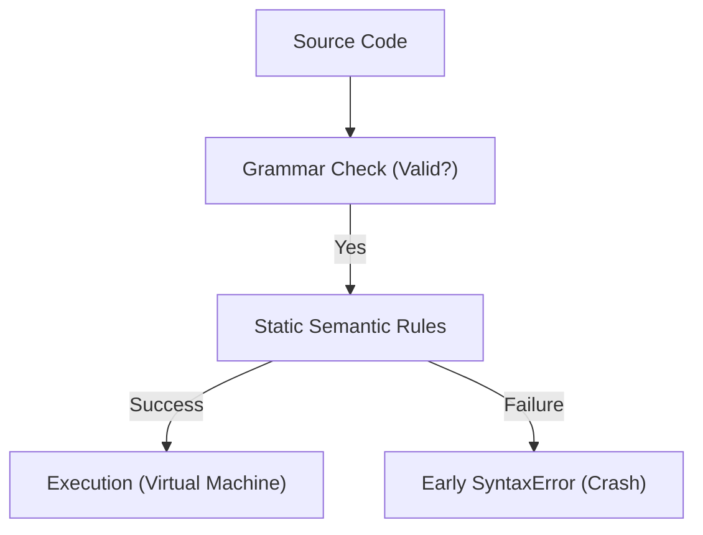

# Buku 04: Static Semantic Rules

*Mastering the Guardrails of JavaScript*

## 🏗️ Static Semantic Validation Gate

## 1. Mengapa Arsitek Harus Mempelajari Ini?
1.  **Predictability**: Mengetahui aturan main sebelum kode dijalankan menghindarkan Anda dari perilaku *unpredictable* di produksi.
2.  **Optimasi Engine**: Aturan statis adalah dasar bagi engine (seperti V8) untuk melakukan optimasi performa. Kode yang mematuhi aturan statis dengan baik akan lebih mudah dioptimalkan.
3.  **Security**: Banyak celah keamanan dicegah di level semantik statis melalui pembatasan akses dan validasi deklarasi.

---

## Navigasi Pembelajaran
Untuk menjaga fokus pada narasi dan visualisasi mental model, daftar isi lengkap telah dipindahkan ke dokumen terpisah.

👉 **[Lihat Daftar Isi Lengkap & Pemetaan Spec](./docs/contents.md)**

---
*Status: Gold Standard Progress*  
*Versi: v3.01.04.01*  
*Detail Progres: [docs/status.md](./docs/status.md)*
