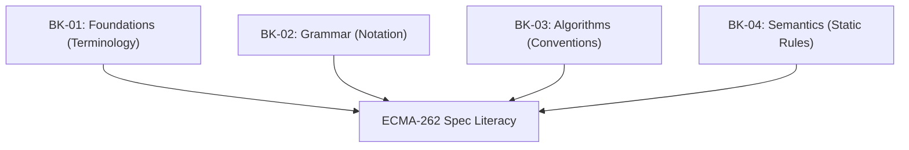

# SR-01: Spec Algorithm Conventions & Grammar (The Spec Basis)

> **"Kekuatan seorang arsitek Hub tidak hanya terletak pada penulisan kode, tapi pada kemampuannya membaca blueprint asli. SR-01 adalah 'Fondasi Utama' (The Spec Basis) — gerbang menuju literasi spesifikasi ECMA-262 yang mendalam."**

*Sub-Rak Status: [docs/status.md](./docs/status.md)*

## 🏗️ The 4 Spec Pillars

## 1. Filosofi Sub-Rak: Spec-Literacy
Tujuan utama sub-rak ini adalah membekali Anda dengan kemampuan membaca dokumentasi resmi (ECMA-262) secara langsung. Kita tidak lagi bergantung pada interpretasi orang ketiga, melainkan langsung ke sumber aslinya.

---

## Koleksi Buku:
| Kode | Judul Buku | Sumber Spec | Kapasitas |
| :--- | :--- | :--- | :--- |
| **BK-01** | [Spec Foundations](./BK-01_SpecFoundations/README.md) | Clause 4.4 | 16 Bab |
| **BK-02** | [Grammar Notation System](./BK-02_GrammarNotationSystem/README.md) | Clause 5.1 | 15 Bab |
| **BK-03** | [Spec Algorithm Conventions](./BK-03_SpecAlgorithmConventions/README.md) | Clause 5.2 | 14 Bab |
| **BK-04** | [Static Semantic Rules](./BK-04_StaticSemanticRules/README.md) | Global ES | 12 Bab |

---
> [!IMPORTANT]
> Seluruh buku di sub-rak ini dirancang untuk sinkron 1:1 dengan struktur sub-seksi ECMA-262 ES2025.
