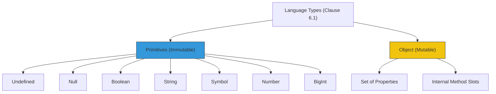

# CH-01: Language Types Overview

*Pemetaan ECMA-262: Clause 6.1*

Spesifikasi membagi "Language Types" menjadi dua kategori besar: **Primitives** dan **Objects**. Ini adalah nilai-nilai yang dapat dimanipulasi secara langsung oleh programmer JavaScript.

## 🏗️ The Type Hierarchy

## 🔍 Karakteristik Utama
- **Primitives**: Nilai yang tidak memiliki properti dan bersifat *immutable* (tidak bisa diubah).
- **Objects**: Kumpulan properti yang dinamis. Objek adalah entitas yang memiliki identitas unik di memori.

> [!IMPORTANT]
> **Identity vs Value**: Dua string `"abc"` dan `"abc"` dianggap sama karena nilainya sama. Dua object `{}` dan `{}` dianggap berbeda karena mereka memiliki identitas internal yang berbeda di memori engine.

---
*Lihat Lab: [Identifikasi Tipe](./examples/type_id.js)*  
*Kembali ke [BK-01](../README.md)*
