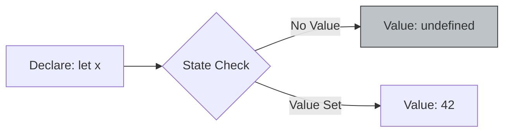

# CH-02: The Undefined Type

*Pemetaan ECMA-262: Clause 6.1.1*

Tipe **Undefined** hanya memiliki satu nilai tunggal, yaitu `undefined`. Ini adalah nilai yang secara otomatis diberikan oleh engine ke variabel atau properti yang belum diinisialisasi.

## 🏗️ State Visualization

## 🔍 Kapan `undefined` muncul?
1. Variabel yang dideklarasikan tapi belum diberi nilai.
2. Parameter fungsi yang tidak dipasok oleh pemanggil.
3. Fungsi yang tidak mengembalikan nilai secara eksplisit menggunakan `return`.
4. Mengakses properti objek yang tidak ada.

> [!TIP]
> **Best Practice**: Meskipun Anda bisa memberikan nilai `undefined` secara manual (`x = undefined`), sebaiknya biarkan engine yang mengelolanya. Gunakan `null` jika Anda ingin menyatakan kekosongan secara sengaja.

---
*Lihat Lab: [Eksperimen Undefined](./examples/undefined_states.js)*  
*Kembali ke [BK-01](../README.md)*
