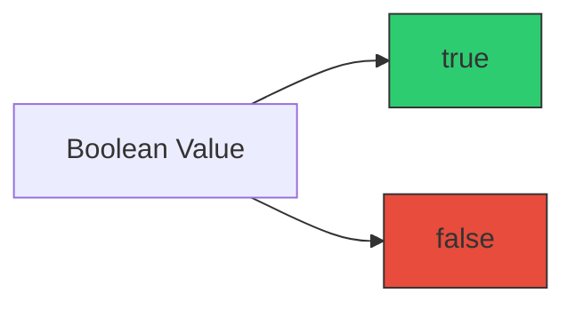

# CH-04: The Boolean Type

*Pemetaan ECMA-262: Clause 6.1.3*

Tipe **Boolean** mewakili entitas logika yang memiliki dua nilai: `true` dan `false`. Ini adalah pondasi dari semua kontrol alur (percabangan) dalam pemrograman.

## 🏗️ Binary Toggle

## 🔍 Logic & Control
Dalam spesifikasi, nilai Boolean digunakan dalam operasi seperti `ToBoolean()` yang mengonversi tipe lain menjadi logika benar/salah.

### Falsy Values (The "Off" States):
Dalam JavaScript, nilai-nilai berikut dianggap **false** saat dikonversi:
- `false`
- `undefined`
- `null`
- `0`, `-0`, `NaN` (Numbers)
- `0n` (BigInt)
- `""` (Empty String)

> [!IMPORTANT]
> **Wrapper Alert**: Jangan gunakan `new Boolean(false)`. Hasilnya adalah sebuah **Object**, yang dalam JavaScript selalu dianggap *truthy*, bahkan jika nilai internalnya adalah false!

---
*Lihat Lab: [Eksperimen Boolean](./examples/binary_logic.js)*  
*Kembali ke [BK-01](../README.md)*
