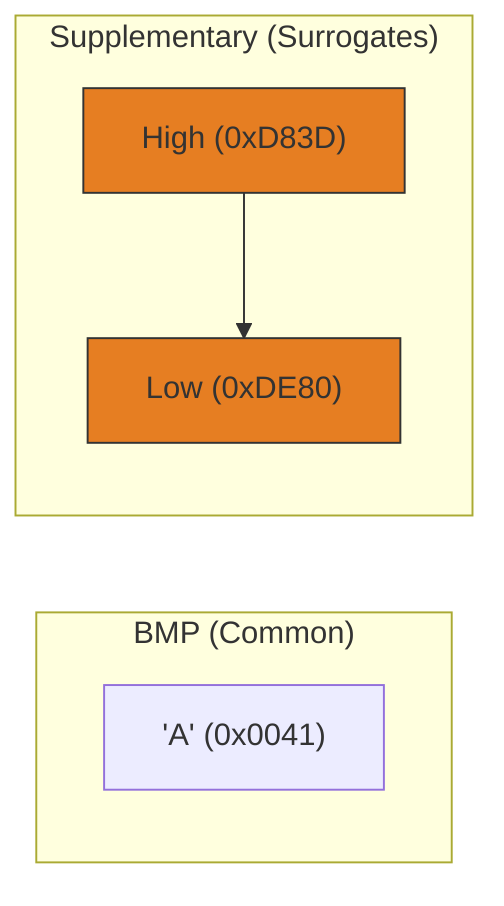

# CH-05: The String Type

*Pemetaan ECMA-262: Clause 6.1.4*

Tipe **String** adalah urutan elemen integer 16-bit tanpa tanda (unsigned) yang mewakili unit kode UTF-16.

## 🏗️ UTF-16 Memory Mapping

## 🔍 Karakteristik Unit Kode
- **Length**: Properti `.length` menghitung jumlah unit 16-bit, bukan jumlah karakter visual.
- **Empty String**: String dengan panjang 0.
- **Immutability**: Sekali dibuat, isi string tidak bisa diubah. Operasi seperti `.toUpperCase()` menghasilkan string baru di memori.

> [!IMPORTANT]
> **Surrogate Pairs**: Untuk karakter di atas `0xFFFF` (seperti kebanyakan emoji), ECMAScript menggunakan dua unit kode. Inilah alasan mengapa `"🚀".length` adalah `2`. Untuk menghitung karakter visual secara akurat, gunakan iterator: `[..."🚀"].length`.

---
*Lihat Lab: [Eksperimen Encoding](./examples/string_encoding.js)*  
*Kembali ke [BK-01](../README.md)*
