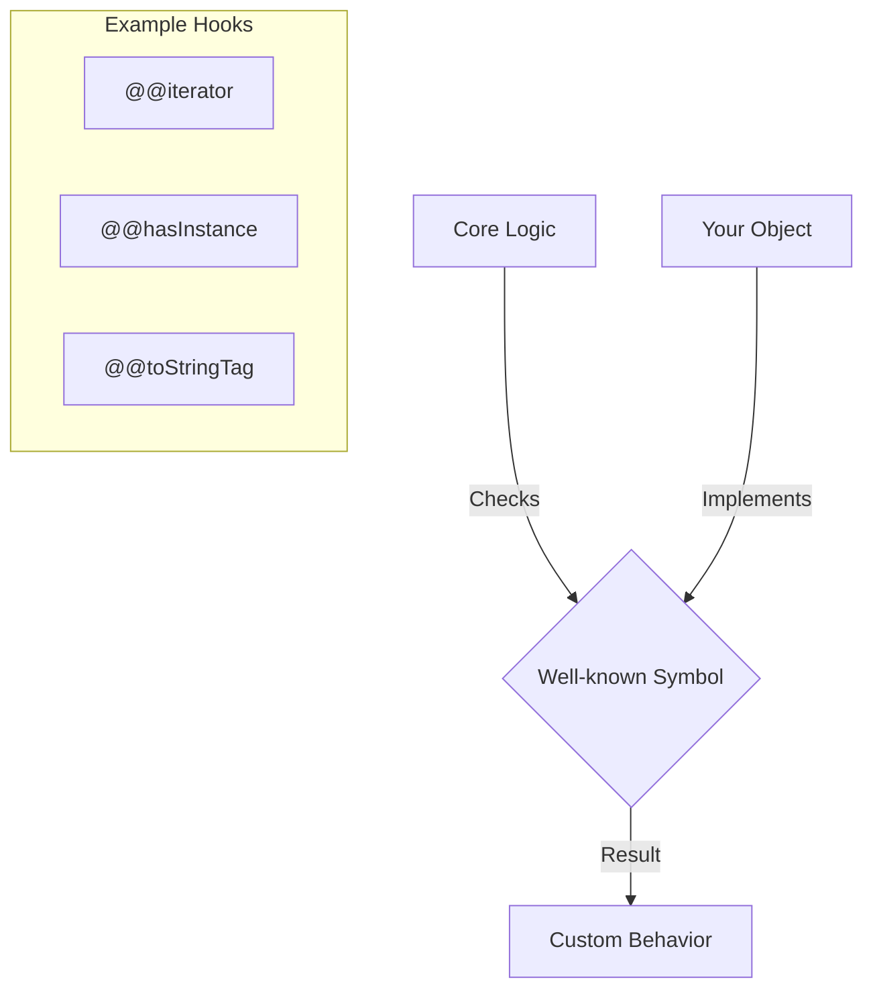

# CH-08: Well-known Symbols (The Protocol Hooks)

*Pemetaan ECMA-262: Clause 6.1.5.1 (Table 1)*

**Well-known Symbols** adalah simbol-simbol konstan yang digunakan oleh spesifikasi untuk mendefinisikan perilaku tingkat rendah serta protokol yang digunakan secara internal oleh engine.

## 🏗️ Protocol Integration

## 🔍 Simbol Populer & Perannya
- `Symbol.iterator`: Mengatur bagaimana objek diulang menggunakan `for...of`.
- `Symbol.hasInstance`: Mengatur perilaku operator `instanceof`.
- `Symbol.toStringTag`: Mengubah string yang dihasilkan oleh `Object.prototype.toString`.
- `Symbol.toPrimitive`: Mengatur konversi objek ke nilai primitif (Number/String).

> [!TIP]
> **Metaprogramming**: Penggunaan well-known symbols adalah bentuk metaprogramming, di mana Anda menulis kode yang berinteraksi atau memodifikasi fitur internal bahasa itu sendiri.

---
*Lihat Lab: [Demo Hook Protokol](./examples/custom_hooks.js)*  
*Kembali ke [BK-01](../README.md)*
