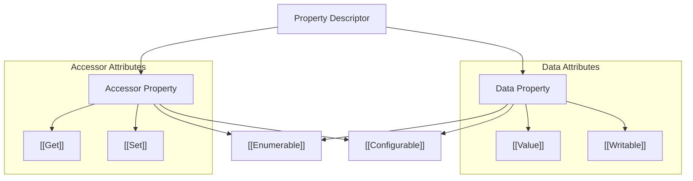

# CH-10: Property Attributes

*Pemetaan ECMA-262: Clause 6.1.7.1*

Dalam spesifikasi, isi dari sebuah objek bukan sekadar nilai langsung, melainkan sebuah **Descriptor** yang berisi kumpulan atribut.

## 🏗️ Descriptor Structure

## 🔍 Atribut Utama
1. **[[Value]]**: Nilai aktual dari properti.
2. **[[Writable]]**: Jika `false`, nilai tidak bisa diubah lewat operator penugasan (`=`).
3. **[[Enumerable]]**: Jika `true`, muncul dalam perulangan `for...in`.
4. **[[Configurable]]**: Jika `false`, tipe properti tidak bisa diubah dan properti tidak bisa dihapus.
5. **[[Get]] / [[Set]]**: Fungsi yang dipanggil saat membaca atau menulis properti (untuk Accessor Property).

---
*Lihat Lab: [Audit Descriptor](./examples/descriptor_audit.js)*  
*Kembali ke [BK-01](../README.md)*
