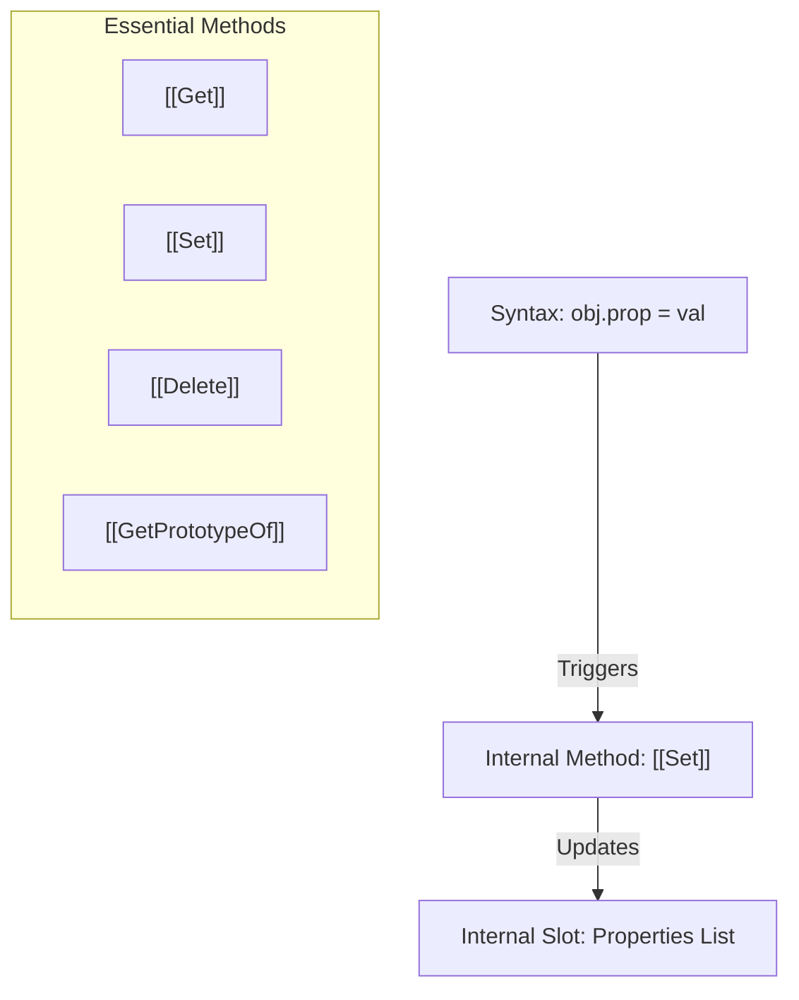

# CH-11: Essential Internal Methods & Slots

*Pemetaan ECMA-262: Clause 6.1.7.2 & 6.1.7.3*

Setiap objek dalam ECMAScript memiliki sekumpulan **Internal Methods** yang menentukan perilaku runtime-nya. Method ini tidak dapat dipanggil langsung dari kode JS, melainkan dipicu oleh operasi bahasa.

## 🏗️ The Internal Bridge

## 🔍 Perbedaan Slot vs Method
- **Internal Slots (`[[SlotName]]`)**: Tempat penyimpanan data internal (seperti state atau metadata). Tidak diwariskan melalui prototype chain.
- **Internal Methods (`[[MethodName]]`)**: Algoritma yang mendefinisikan perilaku fundamental. Objek "Exotic" bisa menimpa method ini untuk perilaku khusus.

---
*Lihat Lab: [Intersepsi Internal](./examples/internal_interception.js)*  
*Kembali ke [BK-01](../README.md)*
