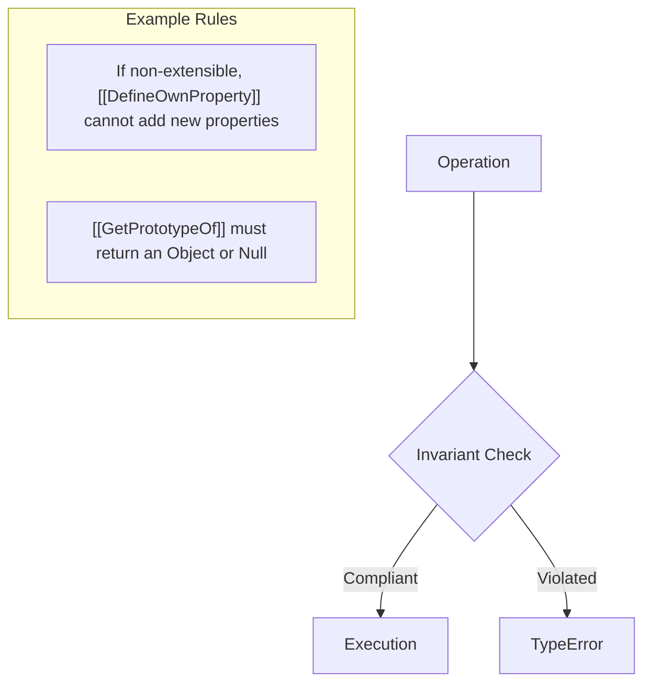

# CH-12: Invariants of Essential Internal Methods

*Pemetaan ECMA-262: Clause 6.1.7.3*

**Invariants** adalah sekumpulan aturan kaku yang harus dipatuhi oleh semua objek (termasuk objek Exotic). Aturan ini menjamin stabilitas bahasa sehingga programmer bisa mengandalkan perilaku objek tertentu secara universal.

## 🏗️ Integrity Guard

## 🔍 Mengapa Invariants Penting?
Tanpa Invariants, sebuah objek Proxy atau objek Exotic dari lingkungan Host (seperti Browser) bisa merusak logika dasar JavaScript (misalnya, tiba-tiba mengubah nilai properti yang sudah di-`freeze`). Invariants memastikan hal itu tidak terjadi.

---
*Lihat Lab: [Penegakan Invariant](./examples/invariant_enforcement.js)*  
*Kembali ke [BK-01](../README.md)*
