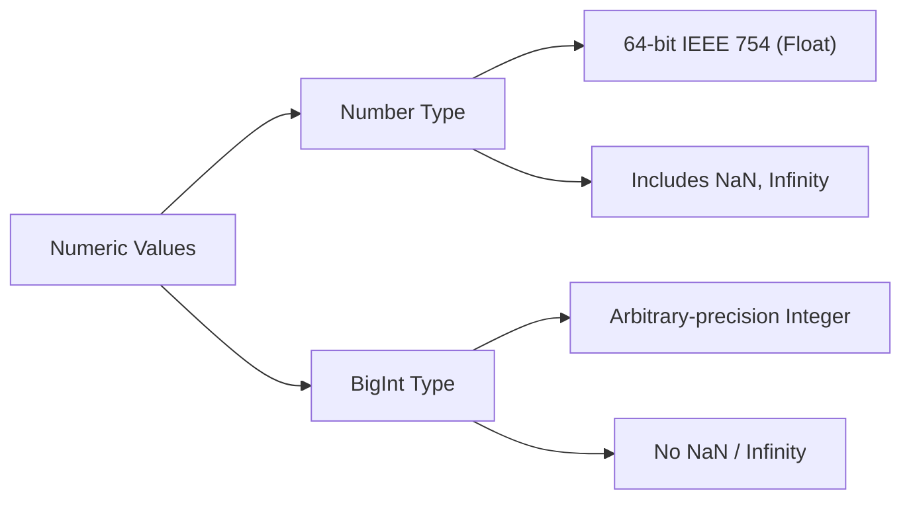

# CH-01: Numeric Types Overview

*Pemetaan ECMA-262: Clause 6.1.6*

ECMAScript menyediakan dua tipe data numerik yang berbeda secara fundamental untuk menangani kebutuhan komputasi: **Number** dan **BigInt**.

## 🏗️ Numeric Duality

## 🔍 Karakteristik Utama
- **Number**: Digunakan untuk hampir semua perhitungan matematika standar. Memiliki presisi sekitar 15-17 angka desimal.
- **BigInt**: Digunakan saat Anda butuh presisi mutlak pada angka bulat yang sangat besar (di atas `2^53 - 1`).

> [!CAUTION]
> **Interoperability**: Anda tidak bisa mencampur `Number` dan `BigInt` dalam satu operasi matematika secara langsung (`1 + 1n` akan melempar `TypeError`). Anda harus melakukan konversi eksplisit.

---
*Lihat Lab: [Showdown Numerik](./examples/numeric_showdown.js)*  
*Kembali ke [BK-02](../README.md)*
