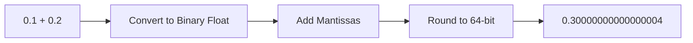

# CH-06: Number Addition & Subtraction

*Pemetaan ECMA-262: Clause 6.1.6.1.6 & 6.1.6.1.7*

Operasi penjumlahan dan pengurangan dalam ECMAScript mengikuti aturan aritmatika IEEE 754.

## 🏗️ The Precision Gap

## 🔍 Aturan Khusus
- Jika salah satu operand adalah **NaN**, hasilnya adalah **NaN**.
- **+Infinity** ditambah **+Infinity** adalah **+Infinity**.
- **+Infinity** dikurangi **+Infinity** adalah **NaN**.
- Penjumlahan tanda berlawanan dari nilai yang sama (`10 + (-10)`) menghasilkan **+0**.

> [!TIP]
> **Financial Math**: Jangan gunakan Number untuk perhitungan uang. Gunakan integer (satuan sen) atau library *decimal* untuk menghindari error pembulatan IEEE 754.

---
*Lihat Lab: [Presisi Float](./examples/float_precision.js)*  
*Kembali ke [BK-02](../README.md)*
