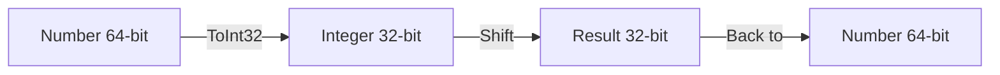

# CH-07: Number Bitwise Shift Operators

*Pemetaan ECMA-262: Clause 6.1.6.1.10 - 6.1.6.1.12*

Meskipun Number adalah 64-bit float, semua operasi bitwise di JavaScript memperlakukan operand-nya sebagai integer 32-bit bertanda (signed) atau tidak bertanda (unsigned).

## 🏗️ 32-bit Internal Conversion

## 🔍 Jenis Pergeseran
1. **Left Shift (`<<`)**: Menggeser bit ke kiri dan mengisi kanan dengan `0`.
2. **Right Shift (`>>`)**: Menggeser ke kanan dan mempertahankan bit tanda (sign-bit).
3. **Unsigned Right Shift (`>>>`)**: Menggeser ke kanan dan mengisi kiri dengan `0` (Hasil selalu positif).

> [!WARNING]
> **Infinity & NaN**: Operasi bitwise pada `Infinity` atau `NaN` akan selalu menganggap nilai tersebut sebagai `0` setelah konversi `ToInt32`.

---
*Lihat Lab: [Mekanika Shifting](./examples/shift_mechanics.js)*  
*Kembali ke [BK-02](../README.md)*
