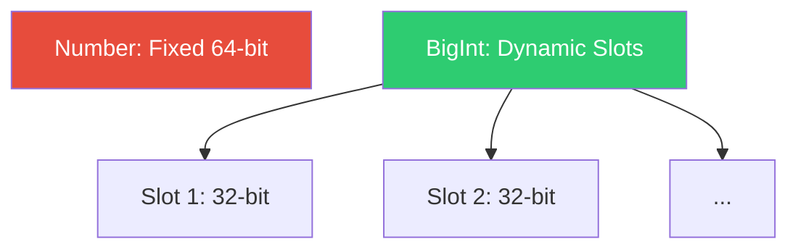

# CH-11: The BigInt Type

*Pemetaan ECMA-262: Clause 6.1.6.2*

Tipe **BigInt** adalah bilangan bulat dengan presisi arbitrer. Tidak seperti Number, BigInt dapat menyimpan angka bulat sebesar apa pun selama memori sistem mencukupi.

## 🏗️ Arbitrary Precision Storage

## 🔍 Perbedaan Kritis dengan Number
- **Tidak ada Desimal**: BigInt hanya untuk angka bulat. `5n / 2n` akan menghasilkan `2n` (pembulatan ke nol).
- **Tidak ada NaN/Infinity**: Operasi yang ilegal (seperti pembagian dengan nol) akan melempar `RangeError`, bukan menghasilkan `Infinity`.
- **Identity**: BigInt bukan objek, ia adalah tipe primitif.

> [!IMPORTANT]
> **Performance**: BigInt jauh lebih lambat daripada Number karena engine harus melakukan simulasi aritmatika secara software, bukan langsung lewat hardware (FPU/ALU). Gunakan hanya saat presisi mutlak diperlukan.

---
*Lihat Lab: [Kekuatan BigInt](./examples/bigint_power.js)*  
*Kembali ke [BK-02](../README.md)*
