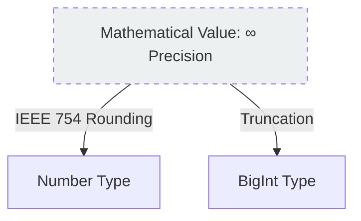

# CH-14: Mathematical Values (The Abstraction)

*Pemetaan ECMA-262: Clause 6.1.6.3*

Dalam spesifikasi, **Mathematical Values (MV)** adalah nilai-nilai matematika ideal yang digunakan untuk mendefinisikan perilaku operasi tanpa terikat pada limitasi hardware.

## 🏗️ The Ideal vs The Real

## 🔍 Mengapa kita butuh MV?
Spesifikasi butuh cara untuk menjelaskan langkah-langkah perhitungan secara logis sebelum angka tersebut "dipaksa" masuk ke dalam format 64-bit yang terbatas. MV memungkinkan definisi operasi yang konsisten di seluruh mesin berbeda.

> [!NOTE]
> **Internalist Hint**: Saat Anda membaca spek dan melihat kalimat *"The mathematical value of..."*, itu berarti spek sedang berbicara tentang angka murni secara teori, bukan tentang bit yang ada di memori.

---
*Lihat Lab: [Ideal vs Realitas](./examples/ideal_vs_real.js)*  
*Kembali ke [BK-02](../README.md)*
