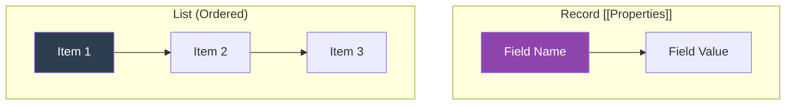

# CH-03: List and Record (The Meta-Structs)

*Pemetaan ECMA-262: Clause 6.2.2 & 6.2.3*

Dalam spesifikasi, **Record** dan **List** adalah tipe data internal yang digunakan oleh algoritma untuk mengelola status dan data. Programmer JS tidak bisa membuat atau memodifikasi mereka secara langsung.

## 🏗️ Internal Data Structures

## 🔍 Karakteristik Kunci
- **Record**: Digunakan untuk menyimpan metadata (seperti Property Descriptor atau Execution Context). Setiap field dinamai dengan kurung siku ganda, misal: `[[Value]]`.
- **List**: Hanya urutan nilai sederhana. Digunakan untuk daftar argumen fungsi atau daftar properti objek.

---
*Lihat Lab: [Simulasi Data Spec](./examples/spec_data_sim.js)*  
*Kembali ke [BK-03](../README.md)*
