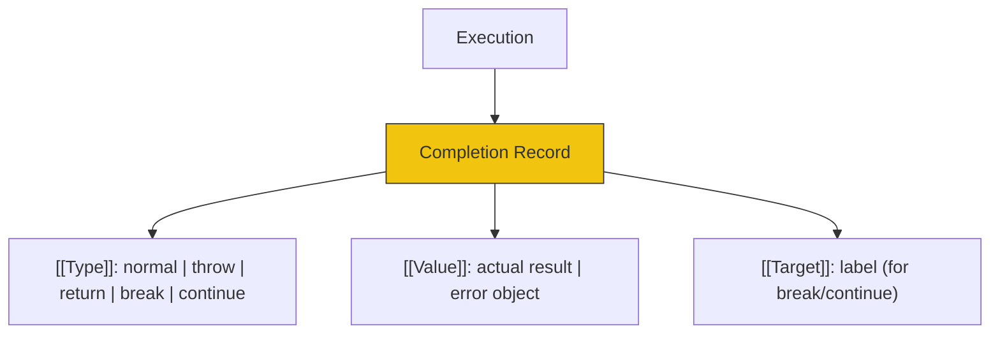

# CH-05: Completion Record (The Control Flow Engine)

*Pemetaan ECMA-262: Clause 6.2.4*

**Completion Record** adalah tipe Record spesifikasi yang digunakan untuk menjelaskan hasil akhir dari eksekusi sebuah pernyataan (statement) atau sekumpulan kode.

## 🏗️ Execution Status Report

## 🔍 Alur Kontrol
1. **Normal Completion**: Kode berjalan lancar ke baris berikutnya.
2. **Abrupt Completion** (`throw`, `return`, `break`, `continue`): Engine harus berhenti dan "mencari" siapa yang bisa menangani (misal: `catch` block atau pemanggil fungsi).

> [!IMPORTANT]
> **Internal Wisdom**: Setiap baris kode yang Anda tulis sebenarnya menghasilkan satu Completion Record. Jika tipenya bukan `normal`, engine akan segera mengubah alur eksekusi.

---
*Lihat Lab: [Laporan Status Eksekusi](./examples/completion_report.js)*  
*Kembali ke [BK-03](../README.md)*
