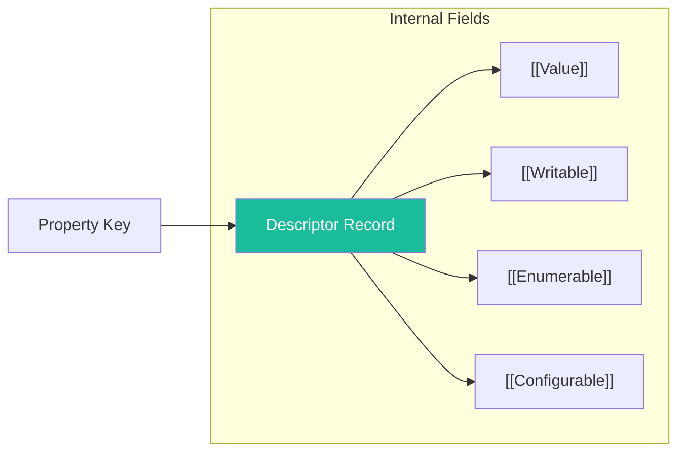

# CH-09: The Property Descriptor Record

*Pemetaan ECMA-262: Clause 6.2.6*

**Property Descriptor** adalah tipe Record spesifikasi yang digunakan untuk mendefinisikan atribut-atribut dari sebuah properti objek (lihat kembali SR-02/BK-01/CH-10).

## 🏗️ Metadata Attribute Mapping

## 🔍 Kegunaan Internal
Setiap kali engine melakukan `[[Get]]` atau `[[Set]]`, ia pertama-tama harus membaca Descriptor ini untuk mengetahui apakah operasi tersebut diizinkan oleh "konstitusi" objek tersebut.

---
*Lihat Lab: [Inspeksi Kartu Identitas Properti](./examples/id_card_inspect.js)*  
*Kembali ke [BK-03](../README.md)*
