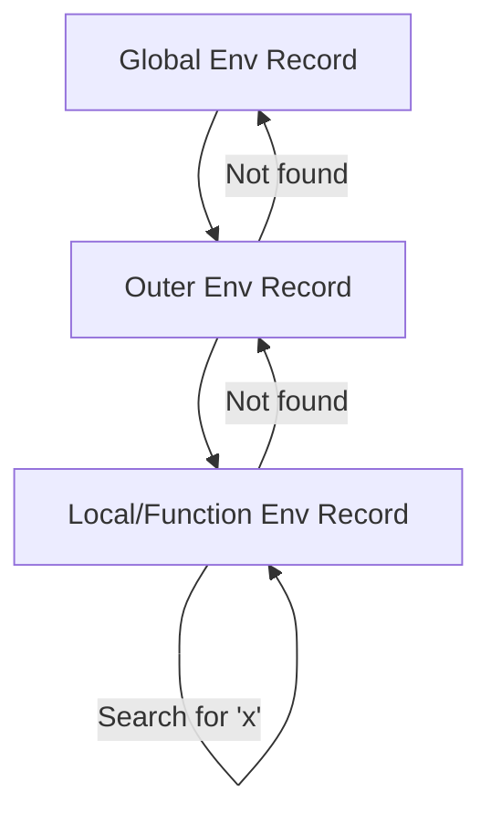

# CH-10: Environment Records (The Variable Ledger)

*Pemetaan ECMA-262: Clause 9.1*

**Environment Record** adalah tipe data spesifikasi (abstraksi) yang digunakan untuk mendefinisikan asosiasi dari *Identifier* ke variabel dan fungsi berdasarkan struktur leksikal kode.

## 🏗️ Scope Ledger Hierarchy

## 🔍 Komponen Utama
- **Declarative Environment Record**: Menyimpan binding variabel (`let`, `const`, `function`).
- **Object Environment Record**: Digunakan untuk binding global (mentransfer properti `window` atau `global` menjadi variabel).
- **Function Environment Record**: Khusus untuk fungsi, menangani `this` dan `super`.

---
*Lihat Lab: [Buku Log Scope](./examples/scope_log.js)*  
*Kembali ke [BK-03](../README.md)*
