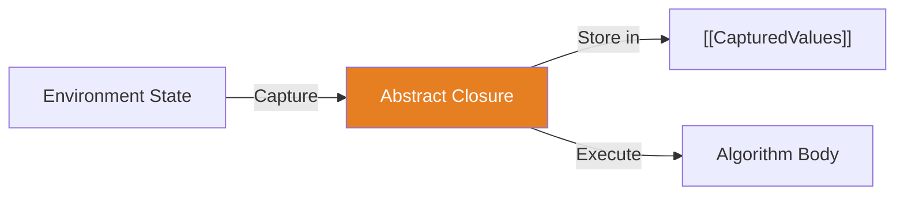

# CH-11: Abstract Closures (The Internal Lambdas)

*Pemetaan ECMA-262: Clause 6.2.8*

**Abstract Closure** adalah tipe data spesifikasi (abstraksi) yang digunakan untuk mendefinisikan sebuah operasi yang dapat menyimpan variabel dari lingkungannya (capturing) dan dieksekusi di lain waktu.

## 🏗️ Capture Mechanism

## 🔍 Mengapa kita butuh Abstract Closures?
Algoritma spesifikasi seringkali perlu menjadwalkan tugas yang akan dijalankan nanti (seperti pada Promise atau Generator). Abstract Closures memberikan cara formal bagi spek untuk mengatakan "Ingat variabel ini dan jalankan logika ini nanti".

---
*Lihat Lab: [Simulasi Penangkapan Closure](./examples/closure_capture_sim.js)*  
*Kembali ke [BK-03](../README.md)*
