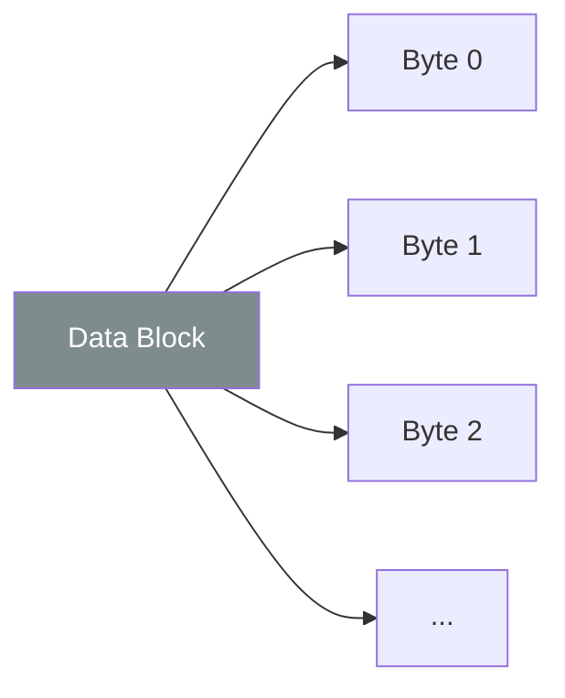

# CH-12: Data Blocks (Raw Memory)

*Pemetaan ECMA-262: Clause 6.2.9*

**Data Block** adalah tipe data spesifikasi yang mewakili urutan nilai byte yang dapat diubah. Ini adalah landasan untuk `ArrayBuffer` dan `SharedArrayBuffer` di JavaScript.

## 🏗️ Byte Sequence Mapping

## 🔍 Karakteristik
- **Fixed Size**: Ukuran blok ditentukan saat pembuatan dan tidak bisa diubah (immutable size).
- **Atomic Operations**: Digunakan dalam konteks multi-threading untuk memastikan data tidak rusak saat diakses bersamaan.

---
*Lihat Lab: [Simulasi Memori Mentah](./examples/raw_memory_sim.js)*  
*Kembali ke [BK-03](../README.md)*
