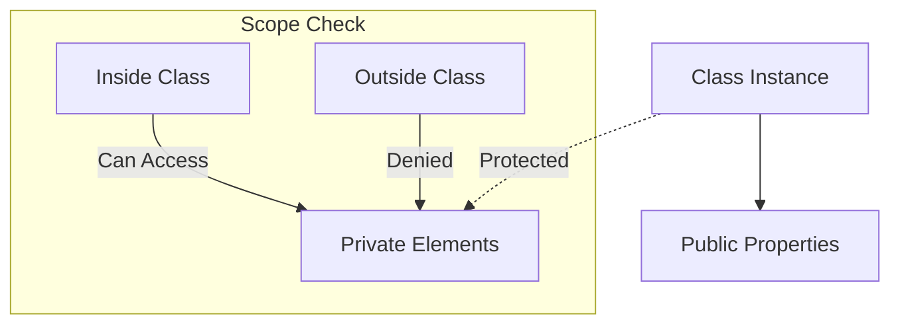

# CH-14: Private Element (Encapsulation)

*Pemetaan ECMA-262: Clause 6.2.11*

**Private Element** adalah tipe data internal yang digunakan untuk mewakili anggota kelas privat (field atau method) yang tidak dapat diakses dari luar lingkup kelas tersebut.

## 🏗️ Encapsulation Boundary

## 🔍 Mengapa kita butuh Private Element?
Sebelumnya, JavaScript tidak memiliki mekanisme privasi yang sesungguhnya (developer biasanya menggunakan underscore `_` sebagai konvensi). Private Element memberikan jaminan privasi di tingkat *language core* yang tidak bisa ditembus oleh `Object.keys()` atau `Proxy`.

---
*Lihat Lab: [Simulasi Akses Privat](./examples/private_access_sim.js)*  
*Kembali ke [BK-03](../README.md)*
