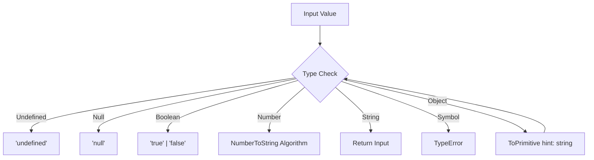

# CH-02: ToString (The Label Conversion)

> **"Setiap unit di Grid butuh identitas yang bisa dibaca manusia. `ToString` adalah 'Konversi Label' (The Label Conversion) — proses mencetak representasi tekstual dari sebuah nilai agar bisa dipahami oleh Terminal Hub."**

*Pemetaan ECMA-262: Clause 7.1.12 (ToString)*

## 🏗️ The ToString Chamber



## 🔍 Mekanisme Konversi

## 1. Mental Model: "The Label Conversion"

Bayangkan sebuah printer label otomatis yang ditempelkan pada setiap unit energi.
- **Number**: Mencetak angka tersebut apa adanya. `0.0000001` mungkin dicetak dalam notasi ilmiah `1e-7`.
- **Undefined**: Dicetak sebagai stiker bertuliskan `"undefined"`.
- **Boolean**: Dicetak sebagai `"true"` atau `"false"`.
- **Symbol**: **ERROR!** Hub melarang printer label mencetak Symbol secara otomatis untuk mencegah kebocoran identifier unik secara tidak sengaja.

---

## 2. Object ke String

Sama seperti `ToNumber`, Object harus melewati `ToPrimitive(input, string)` terlebih dahulu. Secara default, kebanyakan Object di Hub akan dicetak sebagai label generik: `"[object Object]"`.

---

## 3. Praktik Lapangan (Lab)

```javascript
console.log(String(123));        // "123"
console.log(String(null));       // "null"
console.log(String({a:1}));      // "[object Object]"
// console.log(String(Symbol())); // TypeError! (Security Protocol)
```

---

## Arsitek Mindset: Keterbacaan vs Data

Sebagai arsitek Hub:
- Ingat bahwa `ToString` pada Array akan menggabungkan elemen dengan koma (misal: `[1,2]` jadi `"1,2"`).
- Jika Anda ingin melabeli Object secara kustom, override metode `toString()` di dalam kelas mesin Anda.
- Gunakan `JSON.stringify()` jika Anda butuh label yang merinci seluruh isi komponen mesin, bukan sekadar label tipe generik.

---
*Status: [status.md](../../../docs/status.md)*
