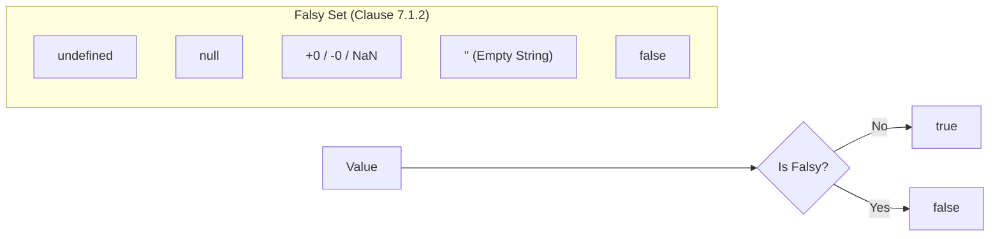

# CH-03: ToBoolean Mechanics (The Switch Logic)

> **"Di dalam Grid, logika percabangan dikendalikan oleh sakelar biner. `ToBoolean` adalah 'Logika Sakelar' (The Switch Logic) — protokol internal yang menentukan apakah sebuah nilai membawa daya yang cukup untuk mengaktifkan switch (`true`) atau membiarkannya mati (`false`)."**

*Pemetaan ECMA-262: Clause 7.1.2 (ToBoolean)*

## 1. Mental Model: "The Switch Logic"

Bayangkan setiap statement `if` atau `while` di Hub adalah sebuah gerbang energi dengan sakelar otomatis.
- **Truthy (Switch ON 🟢)**: Nilai yang memiliki "massa" atau "keberadaan" di Grid. Secara otomatis menghubungkan sirkuit.
- **Falsy (Switch OFF 🔴)**: Nilai yang dianggap sebagai "Kekosongan" atau "Kegagalan Sinyal" oleh spesifikasi.

---

## 2. Daftar Hitam (Falsy List)

Spesifikasi ECMA-262 hanya mendata **6 Sinyal Mati**. Selain ini, sakelar akan selalu menyala:
1.  **`undefined`** (Pipa mati).
2.  **`null`** (Soket kosong).
3.  **`false`** (Instruksi mati).
4.  **`+0`, `-0`, `0n`** (Nol energi).
5.  **`NaN`** (Sinyal rusak).
6.  **`""`** (Pita kosong).

> **Arsitek Note:** Objek kosong `{}` atau Array kosong `[]` tetap menyalakan sakelar (`true`) karena fisiknya ada di Grid, meskipun isinya kosong.

---

## 3. Kurir Estafet: `&&` dan `||`

Di Hub, operator logika bukan sekadar sakelar, mereka adalah kurir yang membawa beban asli:
- **`||` (Fallback Courier)**: Berhenti dan memberikan beban pertama yang **menyala** (Truthy).
- **`&&` (Validation Courier)**: Terus berjalan selama beban **menyala**, tapi langsung berhenti dan memberikan beban **mati** (Falsy) pertama yang ia temukan.

---

## 4. Praktik Lapangan (Lab)

```javascript
const signal = 0;
const status = signal || "DEFAULT_ACTIVE"; 
console.log(status); // "DEFAULT_ACTIVE" (Karena 0 mematikan sakelar ||)

const safeStatus = signal ?? "DEFAULT_ACTIVE";
console.log(safeStatus); // 0 (Hanya fallback jika Nullish)
```

---

## 🏗️ The Boolean Gate



## 🔍 Mekanisme Konversi
## Arsitek Mindset: Keamanan Logika

Sebagai arsitek Hub:
- Gunakan `!!` untuk melihat status sakelar secara eksplisit.
- Gunakan **Nullish Coalescing (`??`)** jika Anda ingin sakelar hanya bereaksi pada `null` atau `undefined`, bukan pada angka `0` atau string kosong.
- Pahami bahwa `ToBoolean` adalah operasi yang sangat murah bagi Hub karena hanya melibatkan pengecekan terhadap daftar statis (Falsy list).

---
*Status: [status.md](../../../docs/status.md)*
