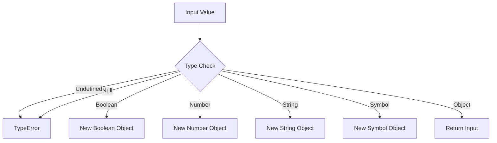

# CH-05: ToObject (The Materializer)

*Pemetaan ECMA-262: Clause 7.1.18 (ToObject)*

**ToObject** adalah operasi abstrak yang digunakan untuk mengubah nilai non-objek menjadi padanannya dalam bentuk objek.

## 🏗️ The Materialization Chamber

## 🔍 Mengapa kita butuh ToObject?
Meskipun variabel Anda mungkin menyimpan string primitif, Anda masih bisa memanggil method seperti `.toUpperCase()`. Hal ini terjadi karena secara internal, engine melakukan **ToObject** sementara untuk membungkus primitif tersebut menjadi objek sehingga method bisa diakses.

> [!CAUTION]
> **Null & Undefined**: Berbeda dengan operasi lain, `ToObject` akan melempar `TypeError` jika inputnya adalah `null` atau `undefined`. Inilah alasan mengapa `null.toString()` gagal.

---
*Lihat Lab: [Eksperimen Materialisasi](./examples/)*  
*Kembali ke [BK-01](../README.md)*
