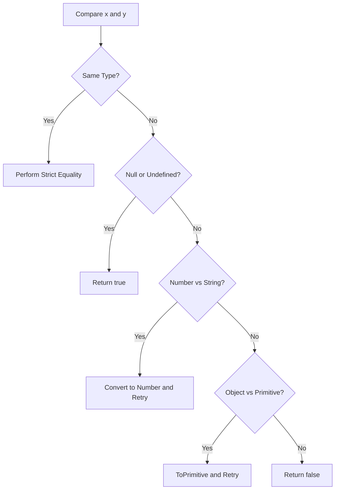

# CH-01: IsLooselyEqual (The Flexible Sensor)

> **"Di dalam Grid, terkadang dua unit yang berbeda tipe harus dianggap setara jika mereka membawa potensi daya yang sama. `isLooselyEqual` (`==`) adalah 'Sensor Fleksibel' (The Flexible Sensor) yang secara otomatis melakukan transmutasi tipe sebelum membandingkan nilai."**

*Pemetaan ECMA-262: Clause 7.2.14 (IsLooselyEqual)*

## 1. Mental Model: "The Flexible Sensor"

Bayangkan sebuah gerbang di Hub yang menerima dua pipa. Jika tipe cairannya berbeda (misal: Air vs Uap), gerbang ini tidak langsung menolak. Sebaliknya, ia akan mencoba mengubah uap menjadi air (Transmutasi) baru kemudian membandingkan volumenya.
- **Fleksibel**: Memungkinkan `0 == false`.
- **Beresiko**: Bisa menyebabkan hasil yang tidak terduga jika teknisi tidak memahami urutan transmutasinya.

---

## 🏗️ The Loose Decision Tree

## 🔍 Mekanisme Operasional

Saat `x == y` dipanggil:
1.  Jika tipe sama -> Gunakan **Strict Equality**.
2.  Jika `null == undefined` -> **true**.
5.  `"" == 0`
6.  Ubah string jadi Number: `0 == 0`.
7.  **Hasil: true!**

---

## Arsitek Mindset: Kapan Menggunakan Sensor Fleksibel?

Sebagai arsitek Hub:
- Gunakan `== null` sebagai cara singkat untuk memeriksa apakah sebuah nilai adalah `null` atau `undefined` sekaligus.
- Di luar kasus tersebut, **hindari `==`**. Terlalu banyak transmutasi otomatis yang bisa menyembunyikan bug data di dalam Grid.
- Gunakan `===` sebagai standar default untuk semua perbandingan unit di Hub Anda.

---
*Status: [status.md](../../../docs/status.md)*
