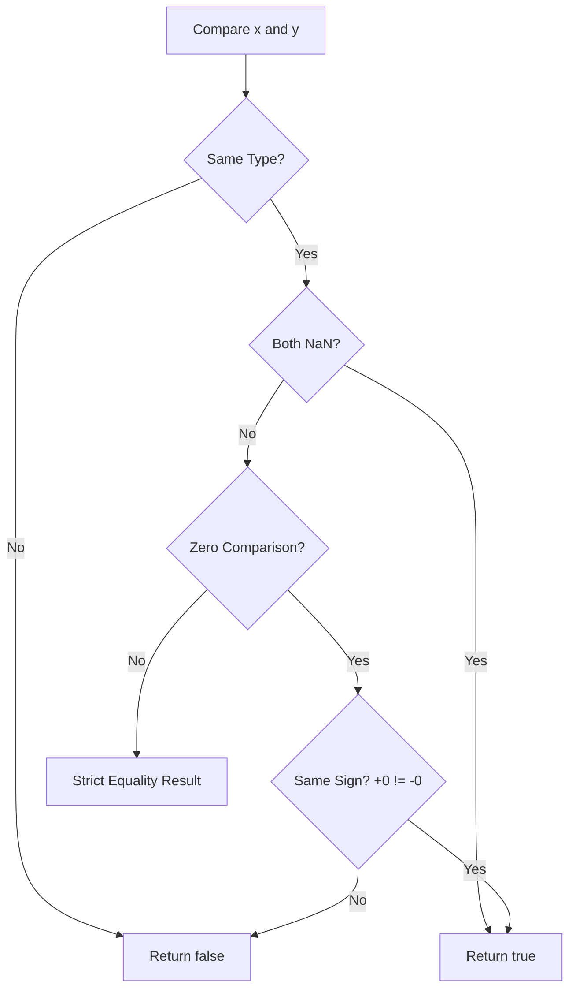

# CH-03: SameValue & SameValueZero (The Identity Scanners)

> **"Terkadang sensor presisi standar tidak cukup detail. `SameValue` adalah 'Pemindai Identitas' (The Identity Scanner) — sensor tingkat tinggi yang digunakan secara internal oleh Hub untuk memastikan dua elemen benar-benar tidak bisa dibedakan, bahkan pada level sub-atomik."**

*Pemetaan ECMA-262: Clause 7.2.10 & 7.2.11 (SameValue & SameValueZero)*

## 🏗️ The SameValue Logic



## 🔍 Mekanisme Operasional

- **`SameValue`**: Digunakan oleh `Object.is()`. Sensor ini lebih teliti dari `===`. Ia bisa membedakan `+0` dan `-0`, serta mampu mendeteksi `NaN` secara akurat.
- **`SameValueZero`**: Versi yang sedikit lebih longgar, digunakan secara internal oleh `Map` dan `Set` untuk menentukan kunci unik. Ia menganggap `+0` dan `-0` adalah sama agar tidak membingungkan sistem penyimpanan Hub.

---

## 2. Tabel Komparasi Sensor

| Case | `==` | `===` | `Object.is` | `Map/Set` (Internal) |
| :--- | :--- | :--- | :--- | :--- |
| `0 == "0"` | ✅ true | ❌ false | ❌ false | ❌ false |
| `NaN, NaN` | ❌ false | ❌ false | ✅ true | ✅ true |
| `+0, -0` | ✅ true | ✅ true | ❌ false | ✅ true |

---

## 3. Kapan Hub Menggunakan SameValueZero?

Saat Anda menyimpan data di `Map`:
```javascript
const storage = new Map();
storage.set(0, "A");
storage.set(-0, "B"); 

console.log(storage.get(0)); // "B" (Karena SameValueZero menganggap -0 dan 0 sama)
```

---

## Arsitek Mindset: Memilih Sensor yang Tepat

Sebagai arsitek Hub:
- Gunakan `Object.is` (SameValue) jika Anda butuh logika perbandingan yang sangat ketat untuk fungsionalitas inti (seperti sistem reaktif yang tidak boleh trigger jika nilai benar-benar identik).
- Sadarilah bahwa struktur data modern (`Map`, `Set`, `includes`) menggunakan **SameValueZero**, yang berarti mereka "lebih pintar" dalam menangani `NaN` dibandingkan operator `===` tradisional.

---
*Status: [status.md](../../../docs/status.md)*
