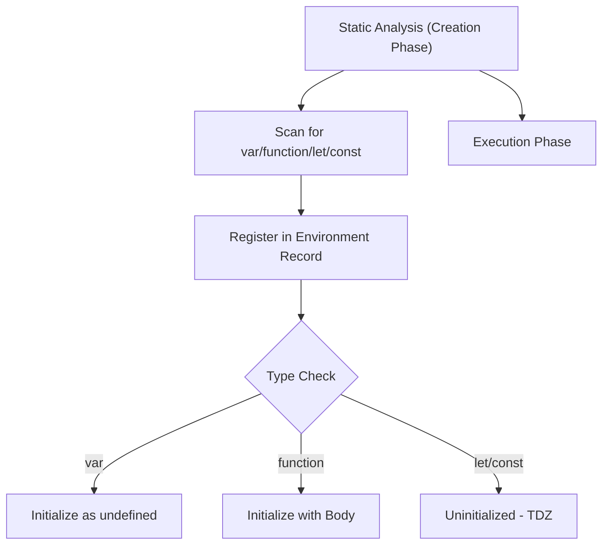

# CH-03: Pre-Activation Scan (Hoisting)

> **"Sebelum sebuah terminal benar-benar dijalankan, Hub melakukan 'Pemindaian Awal' (Pre-Activation Scan). Ini adalah proses mendata semua peralatan (variabel & fungsi) yang tersedia di ruangan sebelum arus listrik dinyalakan."**

*Pemetaan ECMA-262: Clause 8.1.1 (Environment Records & Hoisting)*

## 1. Mental Model: "The Pre-Activation Scan"

Bayangkan seorang teknisi masuk ke ruangan Hub yang gelap dengan senter. Sebelum menyalakan lampu utama, dia menyenter ke seluruh sudut untuk mencatat:
- *"Oh, ada generator di sana (Function Declaration)."* -> Langsung dipasang dan bisa dipakai.
- *"Ada kotak kabel (var) di sini."* -> Diberi label tapi belum ada isinya (`undefined`).
- *"Ada baterai modern (let/const) di sana."* -> Diberi tanda bahaya (**Temporal Dead Zone**); teknisi tahu itu ada, tapi dilarang menyentuhnya sampai lampu utama menyala.

---

## 2. Hierarki Pemindaian

| Elemen | Status Saat Scan | Efek di Grid |
| :--- | :--- | :--- |
| **Function Declaration** | Inisialisasi Penuh | Bisa dipanggil sebelum baris definisinya. |
| **`var` Variable** | Inisialisasi `undefined` | Bisa diakses tapi isinya kosong (undefined). |
| **`let` / `const`** | Uninitialized | Memicu `ReferenceError` jika diakses sebelum deklarasi (TDZ). |

---

## 🏗️ The Hoisting Lifecycle



## 3. Praktik Lapangan (Lab)

```javascript
console.log(techName); // undefined (Hoisted)
var techName = "ALICE";

// console.log(tool); // ReferenceError (TDZ Protection!)
let tool = "WRENCH";
```

---

## Arsitek Mindset: Keamanan Deklarasi

Sebagai arsitek Hub:
- Selalu gunakan `let` dan `const` untuk menghindari kebingungan akibat inisialisasi `undefined` dari `var`.
- Posisikan deklarasi fungsi dan variabel di bagian atas blok kode (Manual Hoisting) agar teknisi lain yang membaca kode Anda tidak perlu menebak-nebak apa yang tersedia di "Terminal" tersebut.

---
*Status: [status.md](../../../docs/status.md)*
