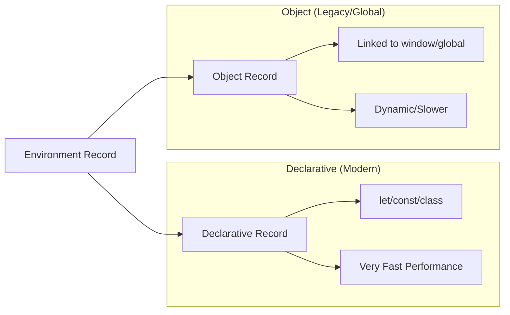

# CH-01: Declarative & Object Records (The Scope Storage)

> **"Data di Hub tidak melayang tanpa alasan. `Environment Records` adalah 'Gudang Penyimpanan' (Scope Storage) — folder-folder internal tempat nama variabel (Keys) dipasangkan dengan nilai energinya (Values)."**

*Pemetaan ECMA-262: Clause 9.1.1 (Environment Records)*

## 1. Mental Model: "The Scope Storage"

Spesifikasi membagi gudang penyimpanan menjadi dua jenis utama:
- **Declarative Environment Record**: Gudang modern yang sangat cepat. Digunakan untuk menyimpan `let`, `const`, `class`, dan `function`. Data di sini disimpan dalam format yang dioptimalkan untuk performa tinggi.
- **Object Environment Record**: Gudang gaya lama yang menggunakan `Object` JavaScript sebagai tempat penyimpanan (seperti `window` di browser). Digunakan untuk Global Scope dan blok `with`.

---

## 2. Kenapa Pembedaan Ini Penting?

- **Declarative** adalah tempat rahasia yang tidak bisa disentuh langsung oleh kode Anda (kecuali melalui nama variabelnya).
- **Object** bersifat transparan. Jika Anda membuat variabel `var` di global, Anda bisa melihatnya di `window.myVar`.

## 🏗️ Record Comparison



## 3. Praktik Lapangan (Lab)

```javascript
var globalPower = 100; // Masuk ke Object Environment Record (Global)
console.log(window.globalPower); // 100 (Di browser)

let localPower = 50;  // Masuk ke Declarative Environment Record (Module/Global)
console.log(window.localPower); // undefined (Tersembunyi di gudang rahasia)
```

---

## Arsitek Mindset: Keamanan Data

Sebagai arsitek Hub:
- Gunakan `let` dan `const` (Declarative) untuk memastikan variabel Anda tersimpan di gudang rahasia yang tidak bisa dimanipulasi secara tidak sengaja melalui properti objek global.
- Pahami bahwa mengakses variabel di *Object Record* sedikit lebih lambat karena Hub harus melakukan pencarian properti objek (`[[Get]]`), sementara *Declarative Record* diakses langsung melalui index memori di level Engine.

---
*Status: [status.md](../../../docs/status.md)*
