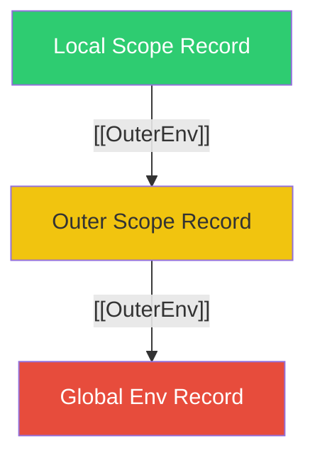

# CH-03: The Outer Link (Scope Chains)

> **"Jika sebuah baki tidak memiliki alat yang dibutuhkannya, ia akan mencari ke baki di bawahnya. `Outer Environment Link` adalah 'Pipa Penghubung Ke Luar' (The Outer Link) — sistem navigasi yang menghubungkan setiap gudang penyimpanan ke gudang induknya."**

*Pemetaan ECMA-262: Clause 9.1.2 (The Outer Environment Link)*

## 1. Mental Model: "The Outer Link"

Bayangkan setiap kotak penyimpanan di Hub memiliki lubang di bagian bawah yang tersambung ke kotak di luarnya.
- Jika Anda mencari kunci "X" di kotak Anda dan tidak ketemu, tangan Anda akan merogoh melalui "Outer Link" ke kotak induk.
- Proses ini berlanjut sampai Anda mencapai **Global Environment**, kotak terakhir yang tidak memiliki Outer Link (`null`).

---

## 🏗️ The Outer Link (Scope Chain)



---

## 3. Praktik Lapangan (Lab)

```javascript
const sector = "CENTRAL";

function alpha() {
    const subSector = "ALPHA_1";
    
    function beta() {
        console.log(subSector); // Ketemu di Outer Link (alpha scope)
        console.log(sector);    // Ketemu di Global Outer Link
    }
    beta();
}
alpha();
```

---

## Arsitek Mindset: Kedalaman Jalur

Sebagai arsitek Hub:
- Ingat bahwa semakin jauh sebuah variabel berada di "Outer Link", semakin lama waktu yang dibutuhkan Hub untuk menemukannya. Posisikan data yang sering digunakan sedekat mungkin dengan terminal aktif.
- **Closures**: Sebuah fungsi membawa "Pipa Outer Link"-nya kemanapun ia pergi, bahkan setelah baki induknya diambil dari rak (Call Stack). Inilah alasan variabel tetap hidup di memori selama fungsinya masih ada.

---
*Status: [status.md](../../../docs/status.md)*
