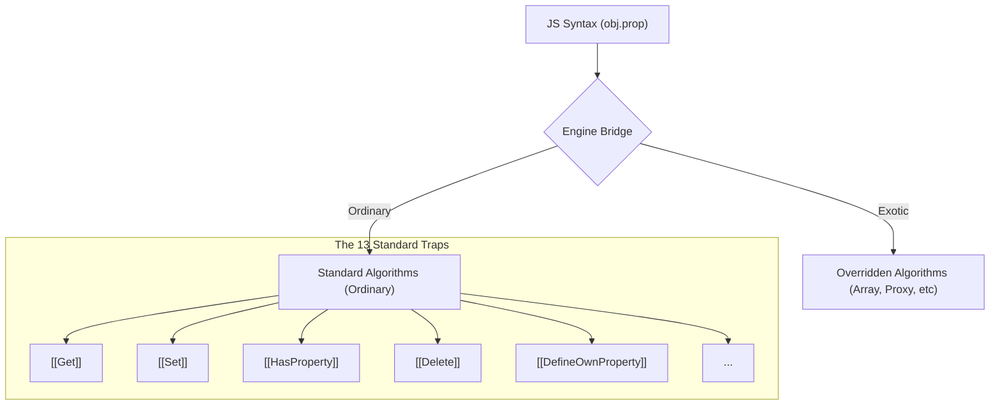

# CH-01: Essential Internal Methods (The Basic Operations)

> **"Setiap mesin di Hub, tidak peduli seberapa kompleksnya, harus mematuhi serangkaian instruksi dasar. `Essential Internal Methods` adalah 'Operasi Dasar' (The Basic Operations) — 13 algoritma fundamental yang mendefinisikan bagaimana sebuah objek berinteraksi dengan sirkuit Grid."**

*Pemetaan ECMA-262: Clause 10.1 (Essential Internal Methods)*

## 🏗️ Internal Methods Bridge

## 1. Mental Model: "The Basic Operations"

Bayangkan setiap objek adalah sebuah unit mesin yang memiliki panel kontrol tersembunyi dengan 13 tombol standar.
- **`[[Get]]`**: Tombol untuk mengambil daya dari slot tertentu.
- **`[[Set]]`**: Tombol untuk mengisi daya ke slot.
- **`[[HasProperty]]`**: Sensor untuk mengecek apakah sebuah slot terpasang.
- **`[[Delete]]`**: Alat untuk mencabut slot secara permanen.

Mesin **Ordinary** menggunakan algoritma standar untuk 13 tombol ini. Mesin **Exotic** mungkin memodifikasi satu atau lebih tombol (misal: tombol `[[Set]]` pada Array juga akan menggerakkan piston `length`).

---

## 2. 13 Tombol Kendali (Penyederhanaan)

1.  `[[GetPrototypeOf]]`: Siapa arsitek dasar mesin ini?
2.  `[[SetPrototypeOf]]`: Ganti arsitek dasar.
3.  `[[IsExtensible]]`: Apakah mesin ini boleh ditambah slot baru?
4.  `[[PreventExtensions]]`: Kunci mesin agar tidak bisa ditambah slot lagi.
5.  `[[GetOwnProperty]]`: Cek slot spesifik di permukaan mesin ini.
6.  `[[DefineOwnProperty]]`: Pasang slot baru dengan aturan ketat.
7.  `[[HasProperty]]`: Scanner keberadaan slot (termasuk dari arsitek).
8.  `[[Get]]`: Ambil nilai dari slot.
9.  `[[Set]]`: Masukkan nilai ke slot.
10. `[[Delete]]`: Hapus slot.
11. `[[OwnPropertyKeys]]`: Daftar semua nama slot yang terpasang.
12. `[[Call]]`: Jalankan mesin (Hanya untuk unit Fungsi).
13. `[[Construct]]`: Gunakan mesin sebagai cetakan untuk unit baru.

---
*Lihat Lab: [Eksperimen Mekanik Internal](./examples/)*  
*Kembali ke [BK-01](../README.md)*
