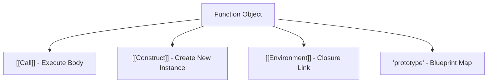

# CH-01: Normal Functions (The Standard Engine)

> **"Setiap mesin membutuhkan penggerak. `OrdinaryFunctionObject` adalah 'Mesin Standar' (The Standard Engine) — unit yang bisa dipanggil (`[[Call]]`) dan bisa memproduksi unit baru (`[[Construct]]`) menggunakan sirkuit prototipenya."**

*Pemetaan ECMA-262: Clause 10.2 (Ordinary Function Objects)*

## 1. Mental Model: "The Standard Engine"

Fungsi biasa adalah unit mesin paling serbaguna di Hub.
- **`[[Call]]`**: Menjalankan mesin untuk memproses input (Argumen) menjadi output.
- **`[[Construct]]`**: Menggunakan mesin sebagai cetakan (Template) untuk membangun unit mesin baru (`new`).
- **`[[Environment]]`**: Kabel yang menghubungkan mesin ke gudang data tempat ia dilahirkan (Closure).

## 🏗️ Function Engine Internals



## 🔍 Mekanisme Operasional

Sebuah mesin standar secara otomatis memiliki properti `.prototype`.
Saat Anda memicu `new MyFunc()`:
1.  Hub menciptakan unit `Ordinary Object` baru.
2.  Menyambungkan sirkuit `[[Prototype]]` unit baru tersebut ke `MyFunc.prototype`.
3.  Menjalankan kode di dalam unit `MyFunc` dengan kabel `this` menunjuk ke unit baru tersebut.

---

## 3. Praktik Lapangan (Lab)

```javascript
function HubGenerator(name) {
    this.name = name;
}

const unit1 = new HubGenerator("ALPHA"); // Menggunakan [[Construct]]
console.log(unit1.name); // "ALPHA"

HubGenerator("BETA"); // Menggunakan [[Call]]
```

---

## Arsitek Mindset: Memilih Mode

Sebagai arsitek Hub:
- Bedakan fungsi yang berperan sebagai **Layanan** (hanya dipanggil) dan fungsi yang berperan sebagai **Pabrik** (dipanggil dengan `new`).
- Gunakan fitur ES6 `class` untuk membuat unit pabrik yang lebih bersih. Secara internal, `class` tetaplah `Ordinary Function Object` namun dengan aturan keamanan tambahan (misal: memicu Error jika dipanggil tanpa `new`).

---
*Status: [status.md](../../../docs/status.md)*
