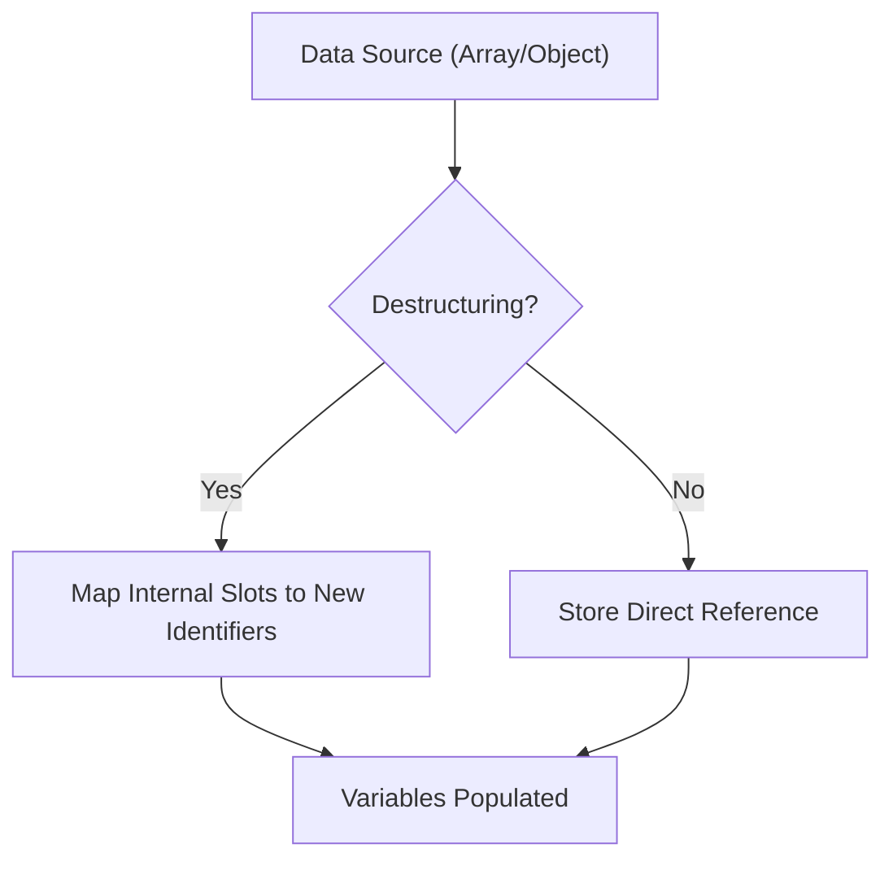

# CH-02: Initializers (Array & Object Units)

> **"Energi seringkali butuh dikelompokkan dalam struktur yang lebih kompleks. `Initializers` adalah 'Unit Pembangun Struktur' — mekanisme untuk merakit Array dan Object langsung di dalam alur ekspresi."**

*Pemetaan ECMA-262: Clause 13.2.4 & 13.2.5 (Array & Object Initializers)*

## 1. Mental Model: "Structural Assembly"

- **Array Initializer `[ ]`**: Membuat baki penyimpanan linier. Setiap elemen adalah slot energi yang bisa diisi oleh ekspresi lain.
- **Object Initializer `{ }`**: Membuat unit penyimpanan berbasis kunci-nilai. Ini adalah blueprint untuk menciptakan **Ordinary Objects**.

---

## 🏗️ Structural Assembly Flow



---

## 3. Praktik Lapangan (Lab)

```javascript
const coreId = "ALPHA";

// Object Assembly dengan Karakteristik Dinamis
const reactor = {
    id: 101,
    [`ZONE_${coreId}`]: "ACTIVE", // Computed Property
    status: "NORMAL"
};

// Array Assembly dengan Spread
const sensors = ["HEAT", "PRESSURE"];
const hubDashboard = ["POWER", ...sensors, "OXYGEN"];

console.log(reactor);
console.log(hubDashboard);
```

---

## Arsitek Mindset: Efisiensi Perakitan

Sebagai arsitek Hub:
- Gunakan Initializers (Literals) alih-alih constructor (`new Object()`, `new Array()`). Literals jauh lebih cepat dieksekusi oleh mesin Hub karena pola perakitannya bersifat statis dan sudah dioptimalkan.
- Berhati-hatilah dengan Spread Operator pada obyek besar, karena ini adalah operasi penyalinan yang memakan energi jika dilakukan berulang kali dalam loop yang padat.

---
*Status: [status.md](../../../docs/status.md)*
