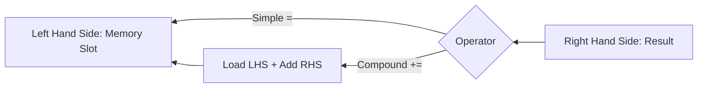

# CH-01: Assignment Operators (The Storage Distribution)

> **"Proses evaluasi tidak akan berguna jika hasilnya tidak disimpan. `Assignment Operators` adalah 'Penyebaran Daya' (The Storage Distribution) — fase terakhir di mana hasil komputasi dari Ruang Mesin dikirimkan dan disimpan secara permanen ke dalam slot memori."**

*Pemetaan ECMA-262: Clause 13.15 (Assignment Operators)*

## 1. Mental Model: "Storage Distribution"

Bayangkan aliran energi yang akhirnya masuk ke dalam tangki penyimpanan:
- **Destructive Assignment (`=`)**: Menghapus isi tangki lama dan menggantinya dengan energi baru.
- **Compound Assignment (`+=`, `*=`, dll)**: Menggabungkan daya yang ada di tangki dengan daya baru dalam satu langkah instan.
- **Logical Assignment (`||=`, `??=`)**: Penyimpanan cerdas yang hanya terjadi jika kondisi tertentu pada tangki terpenuhi (misal: tangki sedang kosong).

## 🏗️ The Assignment Chain



---

## 2. Destructuring Assignment

Hub memiliki kemampuan distribusi massal. Dengan satu instruksi, Anda bisa membagi energi dari satu unit besar ke banyak slot kecil sekaligus.
`const [a, b] = [10, 20];` -> Mendistribusikan isi Array ke baki individu.

---

## 3. Praktik Lapangan (Lab)

```javascript
let totalPower = 100;

// Compound Assignment
totalPower += 50; // 150

// Logical Assignment (Cadangan)
let backupId = null;
backupId ??= "GEN_B"; // Disimpan hanya jika null
console.log(backupId); // "GEN_B"

// Destructuring
const grid = { x: 1, y: 2 };
const { x: sector_x } = grid;
console.log(sector_x); // 1
```

---

## Arsitek Mindset: Presisi Penyimpanan

Sebagai arsitek Hub:
- Gunakan `const` sebanyak mungkin. Hanya gunakan `let` jika Anda benar-benar perlu melakukan "Assignment" ulang pada slot energi tersebut.
- Manfaatkan Destructuring untuk membuat blueprint pengambilan data yang lebih bersih dan deklaratif, sehingga alur distribusi energi di Grid mudah dilacak.

---
*Status: [status.md](../../../docs/status.md)*
