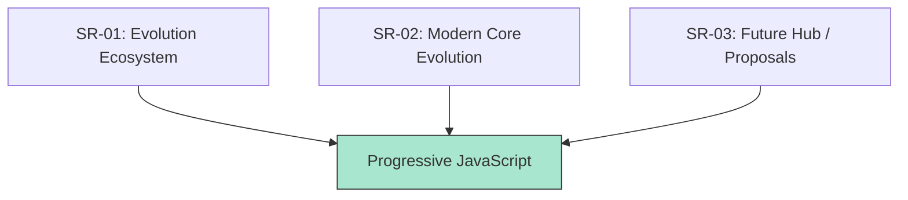

# RAK-03: Evolution & ESNext (The Progress)

> **"Sirkuit yang terus bermutasi. `RAK-03` membedah ekosistem evolusi JavaScript—dari dewan komite TC39 hingga fitur-fitur ESNext terbaru yang siap membentuk masa depan Hub."**

---

## 🏗️ Evolution Hub Architecture

---

## 🛰️ Sub-Rack Collection:

### 1. [SR-01: Evolution Ecosystem](./SR-01-evolution-ecosystem/)
Membedah "Bagaimana" dan "Siapa" di balik layar. Fokus pada tata kelola TC39 dan 5 Tahap siklus spesifikasi (Stages 0-4).

### 2. [SR-02: Modern Core Evolution](./SR-02-modern-core-evolution/)
Membedah "Apa" yang telah berubah. Fokus pada fitur krusial ES2015+: Structural, Async, Data Resilience, dan Metaprogramming.

### 3. [SR-03: Future Hub / Proposals](./SR-03-future-hub-proposals/)
Membedah "Apa Selanjutnya". Memantau proposal aktif di Stage 1-4 seperti Temporal, Decorators, dan Records/Tuples.

---

## 🎯 Architectural Goal
RAK-03 bukan sekadar daftar fitur, melainkan dokumentasi evolusi yang menghubungkan **RAK-04 (Spesifikasi)** dengan **RAK-02 (Foundation)**, memberikan konteks *Mengapa* sebuah fitur ada dan *Bagaimana* ia memengaruhi sirkuit Hub.

---
*Status: [status.md](./docs/status.md) | Universal Architecture: 6-Rack Model*
